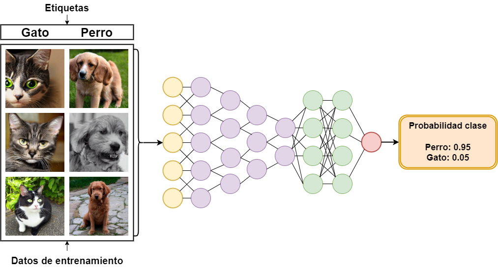

# Bibliografía

* [scikit-learn: machine learning in Python — scikit-learn 1.1.2 documentation](https://scikit-learn.org/stable/index.html)
* [Intuitive Machine Learning - YouTube](https://www.youtube.com/c/IntuitiveMachineLearning)
* [Machine Learning](https://youtube.com/playlist?list=PLblh5JKOoLUICTaGLRoHQDuF_7q2GfuJF&si=lKBpNiBH8dM4UUJ0)
  
# 1. Introducción

## 1.1. Conceptos básicos

El **aprendizaje automático** es una rama de la inteligencia artificial que se enfoca en desarrollar algoritmos y modelos capaces de aprender y mejorar a partir de datos. A diferencia de los enfoques tradicionales de programación, donde las reglas y comportamientos se codifican explícitamente, en el aprendizaje automático los modelos se entrenan para identificar patrones y hacer predicciones basadas en datos de entrenamiento. El proceso de aprendizaje implica la optimización de los parámetros del modelo para minimizar el error en las predicciones.

## 1.2. Tipos de algoritmos

### 1.2.1. Aprendizaje supervisado

<figure style="display: flex; justify-content: center;">
  
</figure>

El **aprendizaje supervisado** se basa en un conjunto de datos etiquetados, como se muestra en la figura anterior. En este enfoque, el objetivo es entrenar un modelo que pueda predecir la salida correcta para datos que no ha visto previamente. El entrenamiento se realiza utilizando ejemplos de entrada junto con sus correspondientes etiquetas de salida. Los algoritmos de aprendizaje supervisado se dividen en dos principales categorías:

- **Algoritmos de clasificación**: Aquí, el modelo predice una clase o categoría para una entrada. Por ejemplo, en la clasificación de correos electrónicos como "spam" o "no spam", el modelo utiliza datos etiquetados para aprender a distinguir entre las diferentes categorías. Ejemplos de algoritmos de clasificación incluyen la regresión logística, las máquinas de vectores de soporte (SVM) y las redes neuronales.

- **Algoritmos de regresión**: En este caso, el modelo predice un valor numérico continuo. Por ejemplo, en la predicción del precio de una casa basado en características como el tamaño y la ubicación, el modelo utiliza datos históricos para aprender la relación entre las variables independientes (características de la casa) y la variable dependiente (precio de la casa). Ejemplos de algoritmos de regresión incluyen la regresión lineal.

### 1.2.2. Aprendizaje no supervisado

<figure style="display: flex; justify-content: center;">
  
</figure>

En el **aprendizaje no supervisado**, como se muestra en la figura anterior, el modelo trabaja con datos que no tienen etiquetas predefinidas. El objetivo es identificar patrones, estructuras o relaciones ocultas en los datos sin una guía explícita. Este enfoque se utiliza para obtener información útil que no se conoce previamente. Los principales usos del aprendizaje no supervisado incluyen:

- **Algoritmos de agrupamiento**: Estos algoritmos buscan agrupar datos similares en conjuntos o clusters. Un ejemplo común es el clustering K-means, que agrupa los datos en $$k$$ clusters basados en la similitud de características.

- **Auto Encoders**: Son redes neuronales que aprenden una representación comprimida de los datos, lo que ayuda a reducir la dimensionalidad y extraer características importantes.

- **Análisis de Componentes Principales (*Principal Component Analysis*, PCA)**: Es una técnica de reducción de dimensionalidad que transforma los datos en un nuevo espacio de características, donde las dimensiones corresponden a las direcciones de mayor varianza en los datos originales.

### 1.2.3. Aprendizaje por refuerzo

<figure style="display: flex; justify-content: center;">
  
</figure>

El **aprendizaje por refuerzo**, ilustrado en la figura anterior, es un área del aprendizaje automático donde un **agente** aprende a tomar decisiones en un entorno para maximizar una recompensa acumulativa. Durante el entrenamiento, el agente interactúa con el entorno y recibe recompensas basadas en las acciones que toma. El objetivo es aprender una política de acción que maximice la recompensa a largo plazo. Los algoritmos comunes en aprendizaje por refuerzo incluyen:

- **Método de Monte Carlo**: Utiliza el promedio de recompensas obtenidas a lo largo de episodios para estimar la calidad de las acciones.

- **Q-learning**: Un algoritmo que actualiza una tabla de valores de acción basada en las recompensas recibidas y las estimaciones futuras de recompensa.

- **Deep Q-Network (DQN)**: Combina Q-learning con redes neuronales profundas para manejar entornos de alta dimensionalidad.

### 1.2.4. Aprendizaje auto supervisado

<figure style="display: flex; justify-content: center;">
  
</figure>

El **aprendizaje auto supervisado** es una técnica donde el modelo aprende a partir de datos sin etiquetas utilizando las propias características de los datos para generar pseudo etiquetas. Este enfoque es útil cuando hay una escasez de datos etiquetados y se desea aprovechar la estructura inherente de los datos. Algunos ejemplos de técnicas de aprendizaje auto supervisado incluyen:

- **Predicción de partes de datos**: Donde se ocultan partes de los datos y el modelo debe predecir esas partes ocultas.

- **Modelos de contraste**: Que aprenden a distinguir entre pares de datos similares y diferentes para aprender representaciones útiles.

## 1.3. Conceptos previos

### 1.3.1. Parámetros e hiperparámetros

Los parámetros son variables internas de un modelo de Machine Learning que se ajustan automáticamente durante el proceso de entrenamiento a través de los datos. Estos determinan el comportamiento del modelo al hacer predicciones. En contraste, los hiperparámetros son configuraciones externas establecidas antes del entrenamiento y afectan el proceso de aprendizaje. Entre los hiperparámetros más comunes se incluyen el número de iteraciones, la tasa de aprendizaje, el tamaño de los lotes y el tipo de algoritmo de optimización.

La elección adecuada de los hiperparámetros es crucial, ya que influye directamente en la capacidad del modelo para generalizar, es decir, en su desempeño al enfrentarse a nuevos datos. Estos valores no se ajustan automáticamente durante el entrenamiento, por lo que requieren pruebas y ajustes manuales mediante técnicas como la validación cruzada o la búsqueda en cuadrícula, entre otros métodos.

### 1.3.2. División del conjunto de datos

Para evaluar adecuadamente el rendimiento de un modelo, es habitual dividir los datos disponibles en tres subconjuntos:

- **Conjunto de entrenamiento**: Se utiliza para ajustar los parámetros del modelo. A partir de estos datos, el modelo intenta identificar patrones.
- **Conjunto de validación**: Permite evaluar el rendimiento del modelo con diferentes valores de hiperparámetros, con el objetivo de optimizarlos. El modelo no se entrena con estos datos.
- **Conjunto de pruebas**: Evalúa el rendimiento final del modelo una vez entrenado y ajustado. Estos datos no han sido vistos por el modelo en ninguna etapa anterior.

Esta separación garantiza una evaluación objetiva de la capacidad del modelo para generalizar.

### 1.3.3. Funciones de coste y pérdida

Las funciones de coste y pérdida son fundamentales para entrenar un modelo de Machine Learning. La **función de pérdida** mide el error por cada instancia, mientras que la **función de coste** calcula el promedio de la función de pérdida en todo el conjunto de datos. El objetivo del entrenamiento es minimizar estas funciones, ajustando los parámetros del modelo para mejorar su precisión en la predicción.

Para problemas de regresión, se utilizan comúnmente funciones de pérdida como el **Error Cuadrático Medio (*Mean Square Error*, MSE)** y el **Error Absoluto Medio (*Mean Absolute Error*, MAE)**. El MSE penaliza los errores grandes al calcular el promedio de los cuadrados de las diferencias entre las predicciones y los valores reales, mientras que el MAE calcula la media de las diferencias absolutas, siendo más robusto frente a valores atípicos.

En problemas de clasificación, la **entropía cruzada** es una función de pérdida habitual. Mide la discrepancia entre la distribución de probabilidad real y la predicha, penalizando más las predicciones incorrectas con alta confianza.

### 1.3.X. Optimización

Los métodos de optimización, entre los que se incluyen la regularización, la normalización de datos, la inicialización de pesos y el uso de lotes, son fundamentales para combatir el sobreajuste y acelerar el aprendizaje \cite{heaton2020applications}\cite{howard2020deep}.

La regularización, que tiene como objetivo reducir el valor global de los pesos, abarca técnicas como la regularización $L_1$ y $L_2$. Estas penalizan respectivamente la suma de los valores absolutos y la suma de los cuadrados de los pesos. Otra técnica relevante es el \emph{Dropout}, que durante el proceso de aprendizaje suprime aleatoriamente neuronas, lo que disminuye la posibilidad de sobreajuste \cite{dropout}. 

La normalización de los datos de entrada facilita la optimización de la función de coste. Esta práctica implica escalar las características de los datos para que tengan una media de $0$ y varianza $1$, o reescalar las características para que se encuentren en un rango específico, como $[0, 1]$. Este procedimiento mejora la convergencia de los algoritmos de optimización al reducir la dispersión de los datos.

Una inicialización adecuada de los pesos es también esencial para un entrenamiento eficaz. Por ejemplo, la inicialización \textit{Glorot} ajusta los pesos iniciales de tal manera que se mantenga la varianza de las activaciones a lo largo de las capas, evitando problemas de desvanecimiento o explosión de gradientes. Otra estrategia consiste en la inicialización de los pesos mediante el uso de modelos preentrenados, que emplea pesos de redes previamente entrenadas en grandes conjuntos de datos, acelerando el entrenamiento y mejorando el rendimiento en tareas específicas.

Además, la división de conjuntos de datos grandes en lotes permite avanzar antes de procesar la totalidad del conjunto de datos, lo que acelera el entrenamiento y reduce el uso de memoria \cite{power2batch}. Los métodos de optimización basados en lotes, como el descenso de gradiente estocástico (\glsf{SGD}) y sus variantes (p. ej., \gls{Adam} y \gls{RMSprop}), se benefician de esta división, permitiendo actualizaciones de los pesos más frecuentes y estables.


# 2. Algoritmos fundamentales

## 2.1. Métodos de regresión

### 2.1.1. Regresión lineal

#### Teoría

La regresión lineal es una técnica de modelado que intenta encontrar la relación lineal entre una variable independiente, $X$, y una variable dependiente, $y$. El objetivo es ajustar una línea recta a los datos de manera que se minimice el error entre los valores reales y los valores predichos por la línea.

<figure style="display: flex; justify-content: center;">
  
</figure>

Con la imagen anterior como ejemplo, la ecuación de la línea roja se define como 

$$
y = wx + b,
$$

donde $$w$$ es el peso (_*weights*_) y $$b$$ es el sesgo (_*bias*_). Estos son los parámetros que el modelo deberá de buscar para ajustarse a los puntos de datos con la intención de minimizar la función de coste.

> Tenemos que recordar que la función de pérdida se calcula para un solo punto de datos y mide la diferencia entre la predicción del modelo y el valor real. Por otro lado, la función de coste es la media de las pérdidas calculadas para todos los puntos de datos en el conjunto de entrenamiento. Esta función de coste se utiliza para evaluar el rendimiento general del modelo y guiar el proceso de entrenamiento para minimizar el error.

Para medir el ajuste de la línea a los datos, es decir, que tan bien se ajusta la línea a la distribución de los datos que tenemos, se suele utilizar el error cuadrático medio (_*Mean Square Error*_, MSE) como función de coste, definido como

$$
\text{MSE} = \frac{1}{N} \sum_{i=1}^{N} (y_i - \hat{y}_i)^2,
$$

donde $$y_i$$ es el valor real y $\hat{y}_i$ es el valor estimado por el modelo para el punto $$i$$, y $$N$$ es la cantidad de puntos de datos existentes en nuestro conjunto de datos.

Para encontrar los mejores valores de $$w$$ y $$b$$ que minimizan la función de coste se utiliza un proceso llamado descenso de gradiente.

> El descenso del gradiente es un algoritmo de optimización utilizado para minimizar funciones de coste en modelos de aprendizaje automático. Funciona ajustando los parámetros del modelo (los pesos y sesgos) en la dirección opuesta al gradiente de la función de coste con respecto a esos parámetros. Para ello, se siguen los pasos siguiente: 
> 1. Se calcula la derivada de la función en un punto dado con el fin de determinar la pendiente de la función.
> 2. Conocida la pendiente de la función se actualizan los parámetros del modelo en la dirección opuesta a la pendiente para reducir el error.
> 3. El proceso se repite hasta que la función de coste alcanza un mínimo, lo que se conoce como la convergencia del modelo.
   
Utilizando la regla de la cadena (a recordar esas clases de cálculo de la universidad) la derivada de la función MSE con respecto a $$w$$ y $$b$$ se define respectivamente como
  
  $$
  \frac{\partial \text{MSE}}{\partial w} = \frac{2}{N} \sum_{i=1}^{N} (y_i - \hat{y}_i) \cdot x_i,
  $$
  
  $$
  \frac{\partial \text{MSE}}{\partial b} = \frac{2}{N} \sum_{i=1}^{N} (y_i - \hat{y}_i),
  $$

La actualización de parámetros se realizaría tal que así

  $$
  w := w - \alpha \cdot \frac{\partial \text{MSE}}{\partial w},
  $$

  $$
  b := b - \alpha \cdot \frac{\partial \text{MSE}}{\partial b},
  $$

donde $\alpha$ es la tasa de aprendizaje (_*learning rate*_) y permite ajustar el tamaño de paso utilizado para actualizar los parámetros del modelo.

> La tasa de aprendizaje es un hiperparámetro, un parámetro que afecta a otros parámetros del modelo, crucial en el descenso del gradiente que determina el tamaño de los pasos que da el modelo al ajustar sus parámetros. 
> 
> + Una tasa de aprendizaje alta puede provocar que el modelo de pasos muy grandes y saltarse el mínimo de la función de coste, lo que puede resultar en una convergencia inestable o en que nunca alcance el mínimo.
> 
> + Una tasa de aprendizaje baja puede provocar que el modelo de pasos muy pequeños, lo que puede hacer que el proceso de entrenamiento sea muy lento y que el modelo tarde mucho en converger, o incluso que se quede atrapado en un mínimo local.
> 
> La clave está en encontrar un balance adecuado para que el modelo converja de manera eficiente y efectiva. A menudo, se utiliza una técnica llamada decaimiento de la tasa de aprendizaje (_*learning rate decay*_), donde la tasa de aprendizaje se reduce gradualmente durante el entrenamiento.

#### Práctica

A continuación se presenta una implementación de utilizando Python:

```python
import numpy as np
from sklearn import datasets
from sklearn.model_selection import train_test_split
from sklearn.metrics import mean_squared_error
import matplotlib.pyplot as plt

class LinearRegression:

    def __init__(self, lr: float = 0.001, n_iterations: int = 1000):

        self.lr = lr
        self.n_iterations = n_iterations
        self.weights = None
        self.bias = None

    def fit(self, X: np.ndarray, y: np.ndarray) -> None:

        n_samples, n_features = X.shape
        self.weights = np.zeros(n_features)
        self.bias = 0
        
        for _ in range(self.n_iterations):

            y_pred = self.predict(X)
            dw = (2/n_samples) * np.dot(X.T, (y_pred - y))
            db = (2/n_samples) * np.sum(y_pred - y)

            self.weights -= self.lr * dw
            self.bias -= self.lr * db

    def predict(self, X: np.ndarray) -> np.ndarray:

        return np.dot(X, self.weights) + self.bias

# Ejemplo con dataset de regresión
if __name__ == '__main__':

    # Cargar datos
    X, y = datasets.make_regression(n_samples=100, n_features=1, noise=10, random_state=42)
    X_train, X_test, y_train, y_test = train_test_split(X, y, test_size=0.2, random_state=42)

    # Crear y entrenar el modelo
    model = LinearRegression(lr=0.01, n_iterations=1000)
    model.fit(X_train, y_train)

    # Predicciones
    predictions = model.predict(X_test)

    # Calcular error
    mse = mean_squared_error(y_test, predictions)
    print(f'Error cuadrático medio: {mse}')

    # Mostrar una gráfica con los resultados
    plt.scatter(X_test, y_test, color='blue', label='Datos reales')
    plt.plot(X_test, predictions, color='red', linewidth=2, label='Línea ajustada')
    plt.legend()
    plt.show()
```

### 2.1.2. Regresión logística

#### Teoría

La regresión logística es una técnica de modelado que se utiliza para predecir la probabilidad de una clase en función de las características de los datos. A diferencia de la regresión lineal, que predice valores continuos, la regresión logística genera probabilidades en el rango de 0 a 1. 

El modelo de regresión logística se basa en la función sigmoide, que se define como

$$
\sigma(z) = \frac{1}{1 + e^{-z}},
$$

donde $$z$$ es el resultado de una combinación lineal de las características del modelo. La función sigmoide convierte cualquier valor real en una probabilidad entre 0 y 1, lo cual es útil para clasificación binaria.

Para la regresión logística, utilizamos la **entropía cruzada** como función de costo, cuya fórmula se define como

$$
J(\theta) = -\frac{1}{N} \sum_{i=1}^{N} [y^{(i)} \log(h_{\theta}(x^{(i)})) + (1 - y^{(i)}) \log(1 - h_{\theta}(x^{(i)}))],
$$

donde $h_{\theta}(x)$ es la predicción del modelo

$$
h_{\theta}(x) = \sigma(\theta^T x).
$$

El objetivo es minimizar esta función de costo mediante el uso del descenso de gradiente. La actualización de los parámetros $\theta$ (pesos y sesgo) se realiza mediante

$$
\theta := \theta - \alpha \cdot \frac{\partial J(\theta)}{\partial \theta}.
$$

En este caso, los gradientes para los pesos $$w$$ y el sesgo $$b$$ se calculan respectivamente como

$$
\frac{\partial J(\theta)}{\partial w} = \frac{1}{N} \sum_{i=1}^{N} (h_{\theta}(x^{(i)}) - y^{(i)}) x^{(i)},
$$

$$
\frac{\partial J(\theta)}{\partial b} = \frac{1}{N} \sum_{i=1}^{N} (h_{\theta}(x^{(i)}) - y^{(i)}).
$$

#### Práctica

A continuación se presenta una implementación de regresión logística en Python:

```python
import numpy as np
from sklearn.datasets import load_breast_cancer
from sklearn.model_selection import train_test_split
from sklearn.metrics import accuracy_score

class LogisticRegression:

    def __init__(self, learning_rate: float = 0.001, num_iterations: int = 100000):

        self.learning_rate = learning_rate
        self.num_iterations = num_iterations
        self.weights = None
        self.bias = None

    def sigmoid(self, z: np.ndarray) -> np.ndarray:

        return 1 / (1 + np.exp(-z))

    def fit(self, X: np.ndarray, y: np.ndarray) -> None:

        num_samples, num_features = X.shape
        self.weights = np.zeros(num_features)
        self.bias = 0
        
        for _ in range(self.num_iterations):

            linear_predictions = np.dot(X, self.weights) + self.bias
            predictions = self.sigmoid(linear_predictions)
            
            dw = (1 / num_samples) * np.dot(X.T, (predictions - y))
            db = (1 / num_samples) * np.sum(predictions - y)
            
            self.weights -= self.learning_rate * dw
            self.bias -= self.learning_rate * db

    def predict(self, X: np.ndarray) -> np.ndarray:

        linear_predictions = np.dot(X, self.weights) + self.bias
        predictions = self.sigmoid(linear_predictions)

        return [1 if i > 0.5 else 0 for i in predictions]

# Ejemplo con dataset de cáncer de mama
if __name__ == '__main__':

    # Cargar datos
    data = load_breast_cancer()
    X = data.data
    y = data.target

    # Dividir datos
    X_train, X_test, y_train, y_test = train_test_split(X, y, test_size=0.2, random_state=0)

    # Crear y entrenar el modelo
    model = LogisticRegression(learning_rate=0.01, num_iterations=100000)
    model.fit(X_train, y_train)

    # Hacer predicciones
    y_pred = model.predict(X_test)

    # Evaluar precisión
    accuracy = accuracy_score(y_test, y_pred)
    print(f'Precisión del modelo: {accuracy}')
```

## 2.2. Árboles de Decisión

### Teoría

Los árboles de decisión son una técnica común en el aprendizaje supervisado, aplicable tanto a clasificación como a regresión. Estos modelos organizan las reglas de predicción en una estructura de árbol, donde cada nodo interno representa una condición sobre una característica del conjunto de datos, cada rama refleja el resultado de una prueba, y cada nodo hoja representa una decisión o un valor de salida.

La construcción de un árbol de decisión busca dividir los datos en grupos homogéneos en relación con la variable objetivo. Este proceso involucra **splitting** (división) y **pruning** (poda) para optimizar la clasificación o predicción de los datos.

<figure style="display: flex; justify-content: center;">
  
</figure>

Los componentes principales de un árbol de decisión son:

1. **Nodo raíz (Root Node)**: Representa el conjunto completo de datos y es el punto de partida del árbol.
2. **Nodos internos (Decision Nodes)**: Representan decisiones basadas en las características de los datos y se dividen en ramas que conducen a nodos hijos.
3. **Nodos hoja (Leaf Nodes)**: Representan la predicción final o decisión, sin subdivisión adicional.
4. **Splitting**: Proceso de dividir un nodo en sub-nodos basado en una condición sobre una característica.
5. **Pruning**: Proceso de eliminar ramas del árbol para evitar el sobreajuste y mejorar la generalización del modelo.

Existen dos tipos principales de árboles de decisión:

- **Árboles de clasificación**: Predicen categorías o clases. El objetivo es encontrar la mejor división de los datos para minimizar la impureza en cada nodo, usando métricas como el **índice de Gini** o **entropía**.
- **Árboles de regresión**: Predicen valores numéricos. El objetivo es minimizar la varianza o el error cuadrático medio en cada nodo.

Los árboles de decisión ofrecen ventajas como el manejo de datos categóricos y numéricos, y la facilidad de interpretación. Sin embargo, pueden sobreajustarse cuando son muy profundos. Técnicas como **pruning** y la limitación de la profundidad ayudan a mitigar el sobreajuste. Métodos de ensamblaje como **Random Forest** combinan múltiples árboles para mejorar la robustez y reducir el riesgo de sobreajuste.

#### Cálculo de Ganancia de Información

El **índice de Gini** y la **entropía** son métodos para medir la pureza de un nodo. El índice de Gini se define como:

$$
\text{Gini}(D) = 1 - \sum_{i=1}^k p_i^2
$$

donde $$p_i$$ es la proporción de ejemplos de la clase $$i$$ en el nodo $$D$$. En un nodo puro, el índice de Gini es 0.

La **ganancia de información** mide la reducción de impureza después de un **splitting**. Se calcula como la diferencia entre la impureza del nodo original y la impureza ponderada de los nodos hijos.

### Práctica

Para construir un árbol de decisión, se puede utilizar Python con la biblioteca `scikit-learn` para clasificar datos basados en características. A continuación, se muestra una implementación:

```python
from sklearn.datasets import load_iris
from sklearn.model_selection import train_test_split
from sklearn.tree import DecisionTreeClassifier
from sklearn.metrics import accuracy_score
import matplotlib.pyplot as plt
from sklearn import tree

# Cargar datos
iris = load_iris()
X, y = iris.data, iris.target

# Dividir datos en conjunto de entrenamiento y prueba
X_train, X_test, y_train, y_test = train_test_split(X, y, test_size=0.2, random_state=42)

# Crear el modelo de árbol de decisión
clf = DecisionTreeClassifier()
clf.fit(X_train, y_train)

# Realizar predicciones
y_pred = clf.predict(X_test)

# Evaluar el modelo
accuracy = accuracy_score(y_test, y_pred)
print(f'Precisión del modelo: {accuracy}')

# Visualizar el árbol de decisión
plt.figure(figsize=(20,10))
tree.plot_tree(clf, filled=True, feature_names=iris.feature_names, class_names=iris.target_names)
plt.show()
```

## 2.3. Métodos de agrupamiento 

### 2.3.1. K-means clustering

#### Teoría

El **algoritmo K-means** es una técnica de aprendizaje no supervisado utilizada para agrupar datos en $$k$$ grupos o *clusters* basados en características similares. El objetivo del algoritmo es dividir un conjunto de datos en $$k$$ grupos, de manera que los puntos de datos dentro de cada grupo sean lo más similares posible entre sí y lo más diferentes posible de los puntos en otros grupos.

El proceso de K-means incluye los siguientes pasos:

1. **Inicialización**: Seleccionar $$k$$ puntos al azar del conjunto de datos como los centros iniciales de los *clusters*.
2. **Asignación**: Asignar cada punto de datos al *cluster* cuyo centro esté más cercano. Esta asignación se realiza utilizando una métrica de distancia, generalmente la distancia euclidiana.
3. **Actualización**: Calcular nuevos centros de *clusters* como la media de todos los puntos asignados a cada *cluster*.
4. **Repetición**: Repetir los pasos 2 y 3 hasta que los centros de los *clusters* no cambien significativamente o se alcance un número máximo de iteraciones.

El objetivo del algoritmo es minimizar, como función de coste, la **suma de las distancias cuadradas** entre los puntos de datos y el centro de su *cluster* correspondiente, representada como

$$
J = \sum_{i=1}^{k} \sum_{x \in C_i} \|x - \mu_i\|^2,
$$

donde $$C_i$$ es el conjunto de puntos asignados al *cluster* $$i$$, $$\mu_i$$ es el centro del *cluster* $$i$$, y $$\|x - \mu_i\|^2$$ es la distancia cuadrada entre el punto $$x$$ y el centro del *cluster* $$\mu_i$$.

#### Práctica

A continuación se presenta una implementación de K-means clustering en Python:

```python
import numpy as np
import matplotlib.pyplot as plt
from sklearn.datasets import make_blobs

class KMeans:

    def __init__(self, n_clusters: int = 3, max_iter: int = 300, tol: float = 1e-4):

        self.n_clusters = n_clusters
        self.max_iter = max_iter

        # Tolerancia para la convergencia
        self.tol = tol  

    def fit(self, X: np.ndarray) -> None:

        # Inicialización de los centros de clusters
        np.random.seed(0) 
        self.centers = X[np.random.choice(X.shape[0], self.n_clusters, replace=False)]
        
        for _ in range(self.max_iter):

            # Asignación de cada punto al cluster más cercano
            self.labels = self._assign_labels(X)

            # Cálculo de los nuevos centros de clusters
            new_centers = self._compute_centers(X)

            # Verificar convergencia
            if np.all(np.linalg.norm(new_centers - self.centers, axis=1) < self.tol):

                break

            self.centers = new_centers

    def _assign_labels(self, X: np.ndarray) -> np.ndarray:

        distances = np.linalg.norm(X[:, np.newaxis] - self.centers, axis=2)
        return np.argmin(distances, axis=1)

    def _compute_centers(self, X: np.ndarray) -> np.ndarray:

        centers = np.zeros((self.n_clusters, X.shape[1]))

        for i in range(self.n_clusters):

            centers[i] = np.mean(X[self.labels == i], axis=0)

        return centers

    def predict(self, X: np.ndarray) -> np.ndarray:

        return self._assign_labels(X)

    def plot_clusters(self, X: np.ndarray) -> None:

        plt.scatter(X[:, 0], X[:, 1], c=self.labels, s=50, cmap='viridis')
        plt.scatter(self.centers[:, 0], self.centers[:, 1], c='red', s=200, alpha=0.75, marker='X')
        plt.title('Clusters y Centros')
        plt.xlabel('Feature 1')
        plt.ylabel('Feature 2')
        plt.show()

# Ejemplo con datos sintéticos
if __name__ == '__main__':

    # Generar datos sintéticos
    X, _ = make_blobs(n_samples=300, centers=4, cluster_std=0.60, random_state=0)
    
    # Crear y entrenar el modelo
    model = KMeans(n_clusters=4)
    model.fit(X)

    # Mostrar resultados
    model.plot_clusters(X)
```
### 2.3.2. Spectral clustering

#### Teoría

El **clustering espectral** es una técnica avanzada de agrupamiento que se basa en el análisis espectral de matrices de similitud para identificar estructuras de _*clusters*_ en los datos que no son linealmente separables. A diferencia de métodos tradicionales como K-means, que asumen formas convexas de los _*clusters*_, el clustering espectral puede identificar _*clusters*_ en formas arbitrarias y complejas, incluso aquellos que están entrelazados.

El proceso de clustering espectral se realiza en los siguientes pasos:

1. **Construcción de la Matriz de Similaridad**: Se construye una matriz de afinidad que refleja la relación entre cada par de puntos en el conjunto de datos. Comúnmente, se utiliza la matriz de adyacencia $$A$$, donde $$A_{ij}$$ representa la similitud entre los puntos $$i$$ y $$j$$. Esta matriz se puede construir usando métodos como _*K-nearest neighbors*_ (KNN) y la distancia euclidiana.

2. **Cálculo de la Matriz de Laplaciano**: A partir de la matriz de afinidad, se calcula el **Laplaciano del gráfico** $$L$$. Hay varias versiones del Laplaciano, siendo el Laplaciano Normalizado una de las más comunes:
   
   $$
   L_{sym} = I - D^{-1/2} A D^{-1/2},
   $$
   
   donde $$D$$ es la matriz diagonal de grados, con $$D_{ii}$$ siendo la suma de las similitudes en la fila $$i$$ de $$A$$.

3. **Cálculo de Valores Propios y Vectores Propios**: Se calculan los valores propios y vectores propios de la matriz Laplaciana. Se seleccionan los primeros $$k$$ vectores propios correspondientes a los $$k$$ valores propios más pequeños.

4. **Reducción de Dimensionalidad**: Los datos se proyectan en el espacio definido por estos $$k$$ vectores propios.

5. **Clustering en el Espacio Reducido**: Finalmente, se aplica un algoritmo de clustering tradicional, como K-means, en el espacio reducido para encontrar los _*clusters*_.

#### Práctica

A continuación, se presenta una implementación de clustering espectral desde cero en Python:

```python
import numpy as np
import matplotlib.pyplot as plt
from sklearn.datasets import make_moons
from scipy.spatial import distance_matrix
from scipy.linalg import eigh
from sklearn.cluster import KMeans

class SpectralClustering:

    def __init__(self, n_clusters: int = 2, epsilon: float = 0.3):

        self.n_clusters = n_clusters
        self.epsilon = epsilon

    def fit(self, X: np.ndarray) -> None:

        # Construcción de la matriz de afinidad
        affinity_matrix = self._construct_affinity_matrix(X)
        
        # Cálculo de la matriz de Laplaciano
        laplacian = self._compute_laplacian(affinity_matrix)
        
        # Cálculo de los valores propios y vectores propios
        eigenvalues, eigenvectors = eigh(laplacian)
        
        # Selección de los primeros k vectores propios
        self.eigenvectors = eigenvectors[:, :self.n_clusters]
        
        # Aplicar K-means en el espacio reducido
        self.labels = self._kmeans_clustering(self.eigenvectors)
        
    def _construct_affinity_matrix(self, X: np.ndarray) -> np.ndarray:

        # Calcular la matriz de afinidad usando la distancia euclidiana
        distances = distance_matrix(X, X)
        return np.exp(-distances**2 / (2. * self.epsilon**2))
    
    def _compute_laplacian(self, affinity_matrix: np.ndarray) -> np.ndarray:

        # Matriz de grados
        degrees = np.sum(affinity_matrix, axis=1)
        D = np.diag(degrees)
        
        # Matriz Laplaciana Normalizada
        laplacian = np.identity(len(degrees)) - np.linalg.inv(D**0.5) @ affinity_matrix @ np.linalg.inv(D**0.5)
        return laplacian
    
    def _kmeans_clustering(self, X: np.ndarray) -> np.ndarray:

        kmeans = KMeans(n_clusters=self.n_clusters, random_state=0).fit(X)
        return kmeans.labels_

    def plot_clusters(self, X: np.ndarray) -> None:

        plt.scatter(X[:, 0], X[:, 1], c=self.labels, s=50, cmap='viridis')
        plt.title('Clusters Identificados por Clustering Espectral')
        plt.xlabel('Feature 1')
        plt.ylabel('Feature 2')
        plt.show()

# Ejemplo con datos sintéticos en forma de lunas
if __name__ == '__main__':

    # Generar datos sintéticos
    X, _ = make_moons(n_samples=300, noise=0.1, random_state=42)

    # Crear y entrenar el modelo
    model = SpectralClustering(n_clusters=2, epsilon=0.3)
    model.fit(X)

    # Mostrar resultados
    model.plot_clusters(X)
```
### 2.3.3. Clustering con DBSCAN

#### Teoría

**DBSCAN (Density-Based Spatial Clustering of Applications with Noise)** es un algoritmo de clustering basado en la densidad que identifica clusters agrupando puntos que están densamente conectados y tratando los puntos en regiones de baja densidad como ruido. A diferencia de métodos como K-means, DBSCAN no requiere que se especifique el número de clusters de antemano y puede identificar clusters de formas arbitrarias.

El algoritmo DBSCAN se basa en dos parámetros principales:

1. **ε (epsilon)**: La distancia máxima entre dos puntos para que se consideren vecinos. Define el radio dentro del cual se buscan puntos cercanos.

2. **MinPts (Número Mínimo de Puntos)**: El número mínimo de puntos necesarios para formar un cluster, incluyendo el punto central y los puntos en su vecindad.

**Proceso del Algoritmo DBSCAN:**

1. **Identificación de Puntos de Núcleo**:
   Un punto se considera un punto de núcleo si hay al menos `MinPts` puntos dentro de un radio `ε` alrededor de él.

2. **Expansión de Clusters**:
   Si un punto es un punto de núcleo, se forma un cluster expandiendo desde el punto y agregando todos los puntos densamente conectados.

3. **Asignación de Ruido**:
   Los puntos que no pueden ser alcanzados por ningún punto de núcleo y que no cumplen con el criterio de densidad se etiquetan como ruido.

El algoritmo no utiliza una función de coste explícita sino que se basa en la densidad de puntos y la conectividad para definir los clusters.

#### Práctica

A continuación se presenta una implementación del algoritmo DBSCAN en Python:

```python
import numpy as np
import matplotlib.pyplot as plt
from sklearn.datasets import make_moons
from scipy.spatial import distance_matrix

class DBSCANClustering:

    def __init__(self, eps: float = 0.3, min_samples: int = 5):

        self.eps = eps
        self.min_samples = min_samples

    def fit(self, X: np.ndarray) -> None:

        # Inicializar todas las etiquetas como ruido
        self.labels = np.full(X.shape[0], -1) 
        cluster_id = 0
        
        for i in range(X.shape[0]):

            # Si el punto aún no ha sido etiquetado
            if self.labels[i] == -1:  

                neighbors = self._region_query(X, i)

                if len(neighbors) >= self.min_samples:

                    self._expand_cluster(X, i, neighbors, cluster_id)
                    cluster_id += 1

    def _region_query(self, X: np.ndarray, index: int) -> np.ndarray:

        distances = distance_matrix([X[index]], X)[0]
        return np.where(distances < self.eps)[0]

    def _expand_cluster(self, X: np.ndarray, index: int, neighbors: np.ndarray, cluster_id: int) -> None:

        self.labels[index] = cluster_id
        i = 0

        while i < len(neighbors):

            point_idx = neighbors[i]

            if self.labels[point_idx] == -1:

                self.labels[point_idx] = cluster_id

            elif self.labels[point_idx] == -2:

                self.labels[point_idx] = cluster_id
                point_neighbors = self._region_query(X, point_idx)

                if len(point_neighbors) >= self.min_samples:

                    neighbors = np.concatenate((neighbors, point_neighbors))

            i += 1

    def plot_clusters(self, X: np.ndarray) -> None:

        plt.scatter(X[:, 0], X[:, 1], c=self.labels, s=50, cmap='viridis')
        plt.title('Clusters Identificados por DBSCAN')
        plt.xlabel('Feature 1')
        plt.ylabel('Feature 2')
        plt.show()

# Ejemplo con datos sintéticos en forma de lunas
if __name__ == '__main__':

    # Generar datos sintéticos
    X, _ = make_moons(n_samples=300, noise=0.1, random_state=42)

    # Crear y entrenar el modelo
    model = DBSCANClustering(eps=0.3, min_samples=5)
    model.fit(X)

    # Mostrar resultados
    model.plot_clusters(X)
```

### 2.3.4. K-Medoids clustering

#### Teoría

El **clustering K-Medoids** es una técnica de agrupamiento basada en particiones, que comparte similitudes con el algoritmo K-Means pero con una diferencia fundamental: en lugar de usar la media de los puntos en un cluster como el centroide, el algoritmo K-Medoids utiliza un punto real del conjunto de datos llamado medoid. Este enfoque hace que K-Medoids sea más robusto frente a outliers y al ruido, ya que el medoid es menos sensible a las diferencias extremas en los datos.

**Diferencias entre K-Medoids y K-Means**:
- **K-Means**: Calcula el centroide del cluster como la media de todos los puntos en el cluster.
- **K-Medoids**: Utiliza puntos reales del dataset como medoids para cada cluster, minimizando la suma de las distancias dentro del cluster.

**Proceso del algoritmo K-Medoids**:
1. **Inicialización**: Se seleccionan aleatoriamente $$K$$ puntos del conjunto de datos como los medoids iniciales. Estos puntos se pueden elegir al azar o mediante algún criterio heurístico.
   
2. **Asignación**: Cada punto en el conjunto de datos se asigna al medoid más cercano, utilizando una medida de distancia como la euclidiana. 

3. **Actualización**: Se selecciona un nuevo medoid en el conjunto de datos que minimice la suma de las distancias dentro de su cluster. Este paso implica intercambiar el medoid actual con otro punto del conjunto de datos y recalcular la suma de las distancias para evaluar si el cambio es beneficioso.

4. **Iteración**: Los pasos de asignación y actualización se repiten hasta que los medoids no cambian significativamente entre iteraciones, o hasta que se alcanza un número máximo de iteraciones.

Como ventajas, K-Medoids es menos sensible a los outliers en comparación con K-Means, es relativamente sencillo de implementar y entender, y suele converger en un número fijo de pasos, lo que puede ser más rápido que K-Means en algunos casos. Sin embargo, también presenta una serie de desventajas como el no ser adecuado para problemas de clustering con clusters no esféricos, y que la selección aleatoria inicial de medoids puede llevar a resultados diferentes en ejecuciones sucesivas del algoritmo.

#### Práctica

A continuación, se presenta una implementación del algoritmo K-Medoids en Python desde cero:

```python
import numpy as np
import matplotlib.pyplot as plt
from sklearn.datasets import make_moons
from scipy.spatial.distance import cdist

class KMedoidsClustering:

    def __init__(self, n_clusters: int = 2, max_iter: int = 300):
        self.n_clusters = n_clusters
        self.max_iter = max_iter

    def fit(self, X: np.ndarray) -> None:
        n_samples, n_features = X.shape
        # Inicialización aleatoria de medoids
        medoids_indices = np.random.choice(n_samples, self.n_clusters, replace=False)
        self.medoids = X[medoids_indices]
        
        for _ in range(self.max_iter):
            # Asignación de clusters
            distances = cdist(X, self.medoids, metric='euclidean')
            self.labels = np.argmin(distances, axis=1)
            
            # Actualización de medoids
            new_medoids = np.copy(self.medoids)
            for i in range(self.n_clusters):
                cluster_points = X[self.labels == i]
                if len(cluster_points) > 0:
                    distances_to_points = np.sum(cdist(cluster_points, cluster_points, metric='euclidean'), axis=1)
                    new_medoids[i] = cluster_points[np.argmin(distances_to_points)]
            
            # Comprobar convergencia
            if np.all(new_medoids == self.medoids):
                break
            self.medoids = new_medoids

    def plot_clusters(self, X: np.ndarray) -> None:
        plt.scatter(X[:, 0], X[:, 1], c=self.labels, s=50, cmap='viridis')
        plt.scatter(self.medoids[:, 0], self.medoids[:, 1], c='red', marker='X', s=100, label='Medoids')
        plt.title('Clusters Identificados por K-Medoids')
        plt.xlabel('Feature 1')
        plt.ylabel('Feature 2')
        plt.legend()
        plt.show()

# Ejemplo con datos sintéticos en forma de lunas
if __name__ == '__main__':
    # Generar datos sintéticos
    X, _ = make_moons(n_samples=300, noise=0.1, random_state=42)

    # Crear y entrenar el modelo
    model = KMedoidsClustering(n_clusters=2)
    model.fit(X)

    # Mostrar resultados
    model.plot_clusters(X)
```

### 2.3.5. Agglomerative Hierarchical Clustering

#### Teoría

El **clustering jerárquico aglomerativo** es una técnica de agrupamiento que construye una jerarquía de _*clusters*_ mediante un enfoque de "aglomeración". A diferencia de los métodos de clustering particional como K-means, el clustering jerárquico no requiere que el número de _*clusters*_ se especifique de antemano. En su lugar, el número de _*clusters*_ se puede determinar a partir de la estructura jerárquica construida.

El proceso de clustering jerárquico aglomerativo se realiza en los siguientes pasos:

1. **Inicialización**: Cada punto de datos se considera inicialmente como un cluster individual. Por lo tanto, al principio hay $$N$$ _*clusters*_, donde $$N$$ es el número de puntos de datos.

2. **Fusión**: Se fusionan los dos _*clusters*_ más cercanos en uno solo. La cercanía entre _*clusters*_ puede ser medida de varias maneras, como la distancia mínima (enlace simple), la distancia máxima (enlace completo), o la distancia media (enlace promedio).

3. **Actualización**: Después de fusionar dos _*clusters*_, se actualiza la matriz de distancias para reflejar la distancia entre el nuevo cluster y los _*clusters*_ restantes.

4. **Repetición**: Los pasos de fusión y actualización se repiten hasta que todos los puntos de datos estén en un solo cluster o se alcance el número deseado de _*clusters*_.

5. **Dendrograma**: El resultado del clustering jerárquico se puede visualizar utilizando un dendrograma, que muestra la jerarquía de las fusiones y permite seleccionar el número de _*clusters*_ a partir de la estructura.

#### Práctica

A continuación se presenta una implementación de clustering jerárquico aglomerativo en Python utilizando la librería `scikit-learn`:

```python
import numpy as np
import matplotlib.pyplot as plt
from sklearn.datasets import make_moons
from sklearn.cluster import AgglomerativeClustering
from scipy.cluster.hierarchy import dendrogram, linkage

class AgglomerativeClusteringModel:

    def __init__(self, n_clusters: int = 2):
        self.n_clusters = n_clusters
        self.agglomerative_clustering = AgglomerativeClustering(n_clusters=self.n_clusters)

    def fit(self, X: np.ndarray) -> None:
        self.labels = self.agglomerative_clustering.fit_predict(X)

    def plot_clusters(self, X: np.ndarray) -> None:
        plt.scatter(X[:, 0], X[:, 1], c=self.labels, s=50, cmap='viridis')
        plt.title('clusters Identificados por Clustering Jerárquico Aglomerativo')
        plt.xlabel('Feature 1')
        plt.ylabel('Feature 2')
        plt.show()

    def plot_dendrogram(self, X: np.ndarray) -> None:
        # Calcular el enlace
        Z = linkage(X, 'ward')
        plt.figure(figsize=(10, 7))
        dendrogram(Z)
        plt.title('Dendrograma del Clustering Jerárquico Aglomerativo')
        plt.xlabel('Índice de muestra')
        plt.ylabel('Distancia')
        plt.show()

# Ejemplo con datos sintéticos en forma de lunas
if __name__ == '__main__':
    # Generar datos sintéticos
    X, _ = make_moons(n_samples=300, noise=0.1, random_state=42)

    # Crear y entrenar el modelo
    model = AgglomerativeClusteringModel(n_clusters=2)
    model.fit(X)

    # Mostrar resultados
    model.plot_clusters(X)
    model.plot_dendrogram(X)
```

En esta implementación:

1. **Inicialización**: Se crea un objeto de `AgglomerativeClustering` con el número deseado de _*clusters*_.
2. **Ajuste**: Se ajusta el modelo a los datos utilizando el método `fit`, que asigna cada punto de datos a uno de los _*clusters*_.
3. **Visualización de _*clusters*_**: El método `plot_clusters` muestra los _*clusters*_ formados en un gráfico de dispersión.
4. **Visualización del Dendrograma**: El método `plot_dendrogram` calcula y muestra el dendrograma utilizando la función `linkage` de `scipy` y la función `dendrogram` para visualizar la jerarquía de _*clusters*_.

El dendrograma permite observar cómo se fusionan los _*clusters*_ a lo largo del tiempo y ayuda a decidir el número adecuado de _*clusters*_ cortando el dendrograma a una altura específica. Esta implementación ilustra cómo aplicar el clustering jerárquico aglomerativo y visualizar tanto los _*clusters*_ resultantes como la estructura jerárquica de las fusiones.

### 2.3.7. K-Nearest Neighbors (KNN)

#### Teoría

El algoritmo KNN (K-Nearest Neighbors) es un algoritmo de aprendizaje supervisado utilizado tanto para clasificación como para regresión. La idea principal es calcular la distancia entre un punto de datos nuevo y todos los puntos de datos en el conjunto de entrenamiento. Luego, se seleccionan los $$K$$ puntos más cercanos y, dependiendo del tipo de problema, se realiza la predicción.

En el caso de problemas de clasificación se toma la clase mayoritaria entre los $$K$$ vecinos más cercanos, mientras que para problemas de regresión se calcula el promedio de los valores de los $$K$$ vecinos más cercanos.

<figure style="display: flex; justify-content: center;">
  
</figure>

De la imagen anterior, se observa un conjunto de datos donde los valores verdes pertenecen a un grupo y los valores rojos a otro grupo. Tenemos un nuevo punto de datos, que es amarillo. Calculamos la distancia del punto amarillo a todos los puntos en el conjunto de datos, seleccionamos los 3 vecinos más cercanos ($$K=3$$). Si todos ellos son verdes, clasificamos el nuevo punto como verde.

La distancia que se usa comúnmente en KNN es la distancia Euclidiana, que se define como:

$$
d(x_1, x_2) = \sqrt{\sum_{i=1}^{n} (x_{1i} - x_{2i})^2}
$$

Donde $$x_1$$ y $$x_2$$ son los puntos en el espacio n-dimensional.

#### Práctica

A continuación se presenta una implementación de KNN utilizando Python:

```python
import numpy as np
from collections import Counter
from sklearn import datasets
from sklearn.model_selection import train_test_split
from sklearn.metrics import accuracy_score

class KNN:

    def __init__(self, k: int = 3):

        self.k = k

    def fit(self, X_train, y_train):

        self.X_train = X_train
        self.y_train = y_train

    def predict(self, X_test):

        predictions = [self._predict(x) for x in X_test]

        return np.array(predictions)

    def _predict(self, x):

        # Calcula la distancia entre x y todos los puntos en X_train
        distances = [self.euclidean_distance(x, x_train) for x_train in self.X_train]

        # Obtiene los índices de los K vecinos más cercanos
        k_indices = np.argsort(distances)[:self.k]

        # Obtiene las etiquetas correspondientes a esos K vecinos
        k_nearest_labels = [self.y_train[i] for i in k_indices]

        # Realiza la votación mayoritaria (para clasificación)
        most_common = Counter(k_nearest_labels).most_common(1)

        return most_common[0][0]

    def euclidean_distance(self, x1, x2):

        return np.sqrt(np.sum((x1 - x2) ** 2))

# Uso del algoritmo con el dataset Iris de sklearn
if __name__ == '__main__':

    # Cargamos el conjunto de datos
    iris = datasets.load_iris()
    X, y = iris.data, iris.target

    # Realizamos una división del conjunto de datos para entrenamiento y pruebas
    X_train, X_test, y_train, y_test = train_test_split(X, y, test_size=0.2, random_state=42)

    # Ajustamos el número de vecinos y entrenamos el modelo
    k = 5
    classifier = KNN(k=k)
    classifier.fit(X_train, y_train)
    predictions = classifier.predict(X_test)

    # Calcula la precisión
    accuracy = accuracy_score(y_test, predictions)
    print(f'Precisión: {accuracy}')
```

## 2.4. Perceptrón


# 3. Selección de modelos

## 3.1. Estrategias de selección de modelos

### 3.1.1. Métodos de re-muestreo, Bootstrap

El método de bootstrap consiste en generar múltiples muestras de entrenamiento a partir del conjunto de datos original mediante el muestreo con reemplazo. Esto permite estimar la variabilidad del modelo y obtener una medida de la precisión y robustez del mismo.

**Ejemplo de Implementación**:

```python
import numpy as np
from sklearn.utils import resample
from sklearn.datasets import load_iris
from sklearn.ensemble import RandomForestClassifier
from sklearn.metrics import accuracy_score

# Cargar datos
data = load_iris()
X, y = data.data, data.target

# Número de muestras de bootstrap
n_iterations = 100
n_size = int(len(X) * 0.8)

# Inicializar el clasificador
model = RandomForestClassifier()

# Almacenar los resultados
scores = []

# Bootstrap
for i in range(n_iterations):
    # Crear muestra de bootstrap
    X_resample, y_resample = resample(X, y, n_samples=n_size)
    # Entrenar modelo
    model.fit(X_resample, y_resample)
    # Evaluar modelo
    y_pred = model.predict(X)
    score = accuracy_score(y, y_pred)
    scores.append(score)

print(f'Accuracy promedio en Bootstrap: {np.mean(scores)}')
```

### 3.1.2. División aleatoria (Random Split)

Este método divide el conjunto de datos en dos subconjuntos aleatorios: uno para entrenamiento y otro para prueba. Es una técnica simple y rápida para evaluar el rendimiento del modelo.

**Ejemplo de Implementación**:

```python
from sklearn.model_selection import train_test_split
from sklearn.datasets import load_iris
from sklearn.ensemble import RandomForestClassifier
from sklearn.metrics import accuracy_score

# Cargar datos
data = load_iris()
X, y = data.data, data.target

# Dividir el conjunto de datos
X_train, X_test, y_train, y_test = train_test_split(X, y, test_size=0.2, random_state=42)

# Entrenar el modelo
model = RandomForestClassifier()
model.fit(X_train, y_train)

# Evaluar el modelo
y_pred = model.predict(X_test)
print(f'Accuracy en Random Split: {accuracy_score(y_test, y_pred)}')
```

### 3.1.3. División basada en el tiempo (Time-Based Split)

La división basada en el tiempo es útil cuando se trabaja con datos temporales. Se divide el conjunto de datos en conjuntos de entrenamiento y prueba basados en una fecha o intervalo de tiempo específico.

**Ejemplo de Implementación**:
```python
import pandas as pd
from sklearn.model_selection import train_test_split
from sklearn.ensemble import RandomForestClassifier
from sklearn.metrics import accuracy_score

# Crear datos de ejemplo con una columna de tiempo
dates = pd.date_range(start='2020-01-01', periods=100, freq='D')
data = pd.DataFrame({
    'date': dates,
    'feature1': np.random.randn(100),
    'feature2': np.random.randn(100),
    'target': np.random.randint(0, 2, size=100)
})
data.set_index('date', inplace=True)

# Dividir el conjunto de datos en entrenamiento y prueba basados en el tiempo
split_date = '2020-01-20'
train = data.loc[:split_date]
test = data.loc[split_date:]

X_train, y_train = train.drop('target', axis=1), train['target']
X_test, y_test = test.drop('target', axis=1), test['target']

# Entrenar el modelo
model = RandomForestClassifier()
model.fit(X_train, y_train)

# Evaluar el modelo
y_pred = model.predict(X_test)
print(f'Accuracy en Time-Based Split: {accuracy_score(y_test, y_pred)}')
```

### 3.1.4. Validación cruzada K-Fold (K-Fold Cross-Validation)

La validación cruzada K-Fold divide el conjunto de datos en K subconjuntos (o folds) y entrena el modelo K veces, utilizando cada fold como conjunto de prueba una vez y el resto como conjunto de entrenamiento.

**Ejemplo de Implementación**:
```python
from sklearn.model_selection import cross_val_score
from sklearn.datasets import load_iris
from sklearn.ensemble import RandomForestClassifier

# Cargar datos
data = load_iris()
X, y = data.data, data.target

# Inicializar el clasificador
model = RandomForestClassifier()

# Validación cruzada K-Fold
scores = cross_val_score(model, X, y, cv=5)
print(f'Accuracy promedio en K-Fold Cross-Validation: {np.mean(scores)}')
```

### 3.1.5. Validación cruzada estratificada K-Fold (Stratified K-Fold)

La validación cruzada estratificada K-Fold asegura que cada fold tiene una proporción representativa de cada clase del conjunto de datos, lo que es especialmente útil para problemas de clasificación con clases desbalanceadas.

**Ejemplo de Implementación**:
```python
from sklearn.model_selection import StratifiedKFold, cross_val_score
from sklearn.datasets import load_iris
from sklearn.ensemble import RandomForestClassifier

# Cargar datos
data = load_iris()
X, y = data.data, data.target

# Inicializar el clasificador
model = RandomForestClassifier()

# Inicializar StratifiedKFold
skf = StratifiedKFold(n_splits=5)

# Validación cruzada estratificada K-Fold
scores = cross_val_score(model, X, y, cv=skf)
print(f'Accuracy promedio en Stratified K-Fold Cross-Validation: {np.mean(scores)}')
```

# 4. Preprocesado de datos

El preprocesamiento de datos es una etapa crucial en el flujo de trabajo de ciencia de datos que prepara los datos para el análisis y el modelado. Incluye varias actividades esenciales para asegurar que los datos sean limpios, consistentes y adecuados para los modelos que se utilizarán. Aquí se describen algunas de las técnicas comunes de preprocesamiento:

## 4.1. Limpieza de datos

La limpieza de datos implica identificar y corregir errores o inconsistencias en el conjunto de datos. Esto puede incluir la eliminación de duplicados, la corrección de errores tipográficos y la normalización de valores.

**Ejemplo de Implementación**:
```python
import pandas as pd
import numpy as np

# Crear un DataFrame de ejemplo con datos sucios
data = pd.DataFrame({
    'id': [1, 2, 3, 4, 4, 5],
    'name': ['Alice', 'Bob', 'Alice', 'Eve', 'Eve', np.nan],
    'age': [25, 30, 25, np.nan, 40, 35],
    'salary': [50000, 60000, 50000, 70000, np.nan, 80000]
})

# Eliminar duplicados
data_cleaned = data.drop_duplicates()

# Rellenar valores faltantes en 'name' con un valor predeterminado
data_cleaned['name'].fillna('Unknown', inplace=True)

# Rellenar valores faltantes en 'age' y 'salary' con la mediana
data_cleaned['age'].fillna(data_cleaned['age'].median(), inplace=True)
data_cleaned['salary'].fillna(data_cleaned['salary'].median(), inplace=True)

print(data_cleaned)
```

## 4.2. Normalización y estandarización

La normalización y la estandarización son técnicas para ajustar la escala de las características numéricas. La normalización (o escalado) transforma los datos para que estén en un rango específico, generalmente [0, 1]. La estandarización transforma los datos para que tengan una media de 0 y una desviación estándar de 1.

**Ejemplo de Implementación**:
```python
from sklearn.preprocessing import MinMaxScaler, StandardScaler
import numpy as np

# Datos de ejemplo
data = np.array([[1, 2, 3], [4, 5, 6], [7, 8, 9]])

# Normalización (escalado)
scaler = MinMaxScaler()
data_normalized = scaler.fit_transform(data)
print("Datos normalizados:")
print(data_normalized)

# Estandarización
scaler = StandardScaler()
data_standardized = scaler.fit_transform(data)
print("Datos estandarizados:")
print(data_standardized)
```

## 4.3. Manejo de datos faltantes

El manejo de datos faltantes es esencial para preparar un conjunto de datos para el análisis. Las técnicas incluyen eliminar filas o columnas con datos faltantes o rellenar los valores faltantes con estadísticas como la media, la mediana o valores de moda.

**Ejemplo de Implementación**:
```python
import pandas as pd
import numpy as np

# Crear un DataFrame con datos faltantes
data = pd.DataFrame({
    'feature1': [1, 2, np.nan, 4, 5],
    'feature2': [np.nan, 2, 3, 4, 5]
})

# Eliminar filas con valores faltantes
data_dropped = data.dropna()

# Rellenar valores faltantes con la media de la columna
data_filled = data.fillna(data.mean())

print("Datos con filas eliminadas:")
print(data_dropped)
print("Datos con valores faltantes rellenados:")
print(data_filled)
```

## 4.4. Selección de características (Feature Selection)

La selección de características implica elegir las características más relevantes para el modelo y eliminar las irrelevantes o redundantes. Esto puede mejorar la precisión del modelo y reducir el tiempo de entrenamiento.

**Ejemplo de Implementación**:
```python
from sklearn.datasets import load_iris
from sklearn.feature_selection import SelectKBest, f_classif

# Cargar datos
data = load_iris()
X, y = data.data, data.target

# Selección de las 2 mejores características
selector = SelectKBest(score_func=f_classif, k=2)
X_new = selector.fit_transform(X, y)

# Mostrar características seleccionadas
print("Máscaras de características seleccionadas:")
print(selector.get_support())
print("Características seleccionadas:")
print(X_new[:5])
```

# 5. Sistemas de reducción de dimensionalidad

La reducción de dimensionalidad es una técnica fundamental en el procesamiento de datos que ayuda a simplificar modelos, visualizar datos y mejorar la eficiencia computacional. Aquí se presentan tres métodos populares de reducción de dimensionalidad: PCA, t-SNE y Autoencoders.

## 5.1. PCA (Análisis de Componentes Principales)

PCA es una técnica estadística que transforma un conjunto de datos con muchas variables en un conjunto de datos con menos variables, llamadas componentes principales. Estas componentes son combinaciones lineales de las variables originales y capturan la mayor parte de la varianza en los datos.

**Ejemplo de Implementación**:
```python
import numpy as np
import matplotlib.pyplot as plt
from sklearn.datasets import load_iris

class PCA():

    def __init__(self, num_componentes):

        self.num_componentes = num_componentes
        self.componentes = None
        self.media = None

    def fit(self, X):

        # Centrar los valores
        self.media = np.mean(X, axis = 0)
        X -= self.media

        # Obtener la covarianza
        cov = np.cov(X.T)

        # Obtener los eigenvalores e eigenvectores
        eigenvalues, eigenvectors = np.linalg.eig(cov)

        # Ordenar
        idx = np.argsort(eigenvalues)[::-1]
        eigenvalues = eigenvalues[idx]
        eigenvectors = eigenvectors[idx]

        self.componentes = eigenvectores[:self.num_componentes]

    def transform(self, X):

        X -= self.media
        return np.dot(X, self.componentes.T) 

# Cargar datos
data = load_iris()
X = data.data
y = data.target

# Aplicar PCA para reducir a 2 dimensiones
pca = PCA(num_componentes=2)
X_pca = pca.fit_transform(X)

# Visualizar los datos
plt.figure(figsize=(8, 6))
scatter = plt.scatter(X_pca[:, 0], X_pca[:, 1], c=y, cmap='viridis')
plt.colorbar(scatter, label='Classes')
plt.title('PCA de Iris Dataset')
plt.xlabel('Componente Principal 1')
plt.ylabel('Componente Principal 2')
plt.show()
```

## 5.2. t-SNE (t-Distributed Stochastic Neighbor Embedding)

t-SNE es una técnica de reducción de dimensionalidad que se utiliza principalmente para la visualización. Reduce la dimensionalidad de los datos de alta dimensión en 2 o 3 dimensiones, preservando las relaciones de proximidad en el espacio de alta dimensión.

**Ejemplo de Implementación**:
```python
import numpy as np
import matplotlib.pyplot as plt
from sklearn.manifold import TSNE
from sklearn.datasets import load_iris

# Cargar datos
data = load_iris()
X = data.data
y = data.target

# Aplicar t-SNE para reducir a 2 dimensiones
tsne = TSNE(n_components=2, random_state=42)
X_tsne = tsne.fit_transform(X)

# Visualizar los datos
plt.figure(figsize=(8, 6))
scatter = plt.scatter(X_tsne[:, 0], X_tsne[:, 1], c=y, cmap='viridis')
plt.colorbar(scatter, label='Classes')
plt.title('t-SNE de Iris Dataset')
plt.xlabel('Componente 1')
plt.ylabel('Componente 2')
plt.show()
```

## 5.3. Auto Encoders

Los _*Auto Encoders*_ son redes neuronales utilizadas para la reducción de dimensionalidad mediante el aprendizaje no supervisado. Se componen de un codificador que reduce la dimensión de los datos y un decodificador que reconstruye los datos a partir de la representación reducida.

**Ejemplo de Implementación**:
```python
import numpy as np
import matplotlib.pyplot as plt
from sklearn.datasets import load_iris
from keras.layers import Input, Dense
from keras.models import Model
from keras.optimizers import Adam

# Cargar datos
data = load_iris()
X = data.data

# Definir la arquitectura del autoencoder
input_dim = X.shape[1]
encoding_dim = 2  # Número de dimensiones reducidas

input_layer = Input(shape=(input_dim,))
encoded = Dense(encoding_dim, activation='relu')(input_layer)
decoded = Dense(input_dim, activation='sigmoid')(encoded)

autoencoder = Model(input_layer, decoded)
autoencoder.compile(optimizer='adam', loss='mean_squared_error')

# Entrenar el autoencoder
autoencoder.fit(X, X, epochs=50, batch_size=10, shuffle=True, validation_split=0.2)

# Obtener la representación codificada
encoder = Model(input_layer, encoded)
X_encoded = encoder.predict(X)

# Visualizar los datos
plt.figure(figsize=(8, 6))
scatter = plt.scatter(X_encoded[:, 0], X_encoded[:, 1], c=data.target, cmap='viridis')
plt.colorbar(scatter, label='Classes')
plt.title('Autoencoder de Iris Dataset')
plt.xlabel('Dimensión 1')
plt.ylabel('Dimensión 2')
plt.show()
```

# 6. Evaluación de modelos

La evaluación de modelos es crucial para entender la eficacia y eficiencia de los modelos de aprendizaje automático. Esta sección cubre las métricas de rendimiento utilizadas para clasificación, regresión y clustering.

## 6.1. Métricas de rendimiento para la clasificación

Las métricas de rendimiento en clasificación permiten evaluar la precisión y eficacia de los modelos al hacer predicciones categóricas.

### 6.1.1. Accuracy

La precisión (accuracy) es la proporción de predicciones correctas respecto al total de predicciones realizadas.

**Ejemplo de Implementación**:
```python
from sklearn.metrics import accuracy_score
from sklearn.datasets import load_iris
from sklearn.model_selection import train_test_split
from sklearn.ensemble import RandomForestClassifier

# Cargar datos
data = load_iris()
X = data.data
y = data.target

# Dividir datos
X_train, X_test, y_train, y_test = train_test_split(X, y, test_size=0.3, random_state=42)

# Entrenar el modelo
model = RandomForestClassifier()
model.fit(X_train, y_train)

# Realizar predicciones
y_pred = model.predict(X_test)

# Calcular accuracy
accuracy = accuracy_score(y_test, y_pred)
print(f'Accuracy: {accuracy:.2f}')
```

### 6.1.2. Precisión

La precisión mide la proporción de verdaderos positivos entre los positivos predichos. Es útil en contextos donde el costo de un falso positivo es alto.

**Ejemplo de Implementación**:
```python
from sklearn.metrics import precision_score

# Calcular precisión
precision = precision_score(y_test, y_pred, average='weighted')
print(f'Precisión: {precision:.2f}')
```

### 6.1.3. Recall

El recall mide la proporción de verdaderos positivos entre los positivos reales. Es útil en contextos donde el costo de un falso negativo es alto.

**Ejemplo de Implementación**:
```python
from sklearn.metrics import recall_score

# Calcular recall
recall = recall_score(y_test, y_pred, average='weighted')
print(f'Recall: {recall:.2f}')
```

### 6.1.4. F1 Score

El F1 Score es la media armónica entre precisión y recall. Es una métrica balanceada que considera tanto los falsos positivos como los falsos negativos.

**Ejemplo de Implementación**:
```python
from sklearn.metrics import f1_score

# Calcular F1 Score
f1 = f1_score(y_test, y_pred, average='weighted')
print(f'F1 Score: {f1:.2f}')
```

### 6.1.5. AUC-ROC

El AUC-ROC (Área bajo la Curva de la Característica Operativa del Receptor) mide la capacidad del modelo para distinguir entre clases. Un valor más alto indica una mejor capacidad discriminativa.

**Ejemplo de Implementación**:
```python
from sklearn.metrics import roc_auc_score
from sklearn.preprocessing import label_binarize

# Binarizar las etiquetas para AUC-ROC
y_test_bin = label_binarize(y_test, classes=[0, 1, 2])
y_pred_prob = model.predict_proba(X_test)

# Calcular AUC-ROC
auc_roc = roc_auc_score(y_test_bin, y_pred_prob, multi_class='ovr')
print(f'AUC-ROC: {auc_roc:.2f}')
```

## 6.2. Métricas de rendimiento para la regresión

Las métricas de rendimiento en regresión evalúan la calidad de las predicciones continuas de un modelo.

### 6.2.1. Mean Squared Error (MSE)

El MSE mide el promedio de los cuadrados de los errores, es decir, la diferencia entre los valores predichos y los valores reales.

**Ejemplo de Implementación**:
```python
from sklearn.metrics import mean_squared_error

# Calcular MSE
mse = mean_squared_error(y_test, y_pred)
print(f'Mean Squared Error (MSE): {mse:.2f}')
```

### 6.2.2. Root Mean Squared Error (RMSE)

El RMSE es la raíz cuadrada del MSE y proporciona una medida en las mismas unidades que la variable objetivo, lo que facilita la interpretación.

**Ejemplo de Implementación**:
```python
import numpy as np

# Calcular RMSE
rmse = np.sqrt(mse)
print(f'Root Mean Squared Error (RMSE): {rmse:.2f}')
```

### 6.2.3. Mean Absolute Error (MAE)

El MAE mide el promedio de los errores absolutos entre las predicciones y los valores reales.

**Ejemplo de Implementación**:
```python
from sklearn.metrics import mean_absolute_error

# Calcular MAE
mae = mean_absolute_error(y_test, y_pred)
print(f'Mean Absolute Error (MAE): {mae:.2f}')
```

### 6.2.4. Root Mean Squared Log Error (RMSLE)

El RMSLE mide la raíz cuadrada del error cuadrático medio de los logaritmos de las predicciones y los valores reales. Es útil cuando se desea penalizar las diferencias relativas más que las absolutas.

**Ejemplo de Implementación**:
```python
from sklearn.metrics import mean_squared_log_error

# Calcular RMSLE
rmsle = np.sqrt(mean_squared_log_error(y_test, y_pred))
print(f'Root Mean Squared Log Error (RMSLE): {rmsle:.2f}')
```

### 6.2.5. R-Squared

El R-Squared indica la proporción de la varianza en la variable dependiente que es explicada por el modelo. Un valor de 1 indica una explicación perfecta, mientras que un valor de 0 indica que el modelo no explica nada de la varianza.

**Ejemplo de Implementación**:
```python
from sklearn.metrics import r2_score

# Calcular R-Squared
r_squared = r2_score(y_test, y_pred)
print(f'R-Squared: {r_squared:.2f}')
```

### 6.2.6. Adjusted R-Squared

El Adjusted R-Squared ajusta el R-Squared para tener en cuenta el número de predictores en el modelo. Es útil para comparar modelos con diferentes números de predictores.

**Ejemplo de Implementación**:
```python
# Suponiendo que tienes el número de muestras (n) y el número de características (p)
n = X_test.shape[0]
p = X_test.shape[1]

# Calcular Adjusted R-Squared
adj_r_squared = 1 - (1 - r_squared) * (n - 1) / (n - p - 1)
print(f'Adjusted R-Squared: {adj_r_squared:.2f}')
```

## 6.3. Métricas de rendimiento para algoritmos de clustering

Las métricas de rendimiento en clustering ayudan a evaluar la calidad de la agrupación sin la necesidad de etiquetas verdaderas.

### 6.3.1. Método del codo (Elbow Method)

El método del codo ayuda a determinar el número óptimo de clusters. Se basa en la suma de errores cuadráticos dentro del cluster (inertia) y busca el punto donde la disminución de la inertia se estabiliza.

**Ejemplo de Implementación**:
```python
from sklearn.cluster import KMeans
import matplotlib.pyplot as plt

# Cargar datos
from sklearn.datasets import load_iris
data = load_iris()
X = data.data

# Calcular la suma de errores cuadráticos para diferentes números de clusters
inertia = []
for k in range(1, 11):
    kmeans = KMeans(n_clusters=k, random_state=42)
    kmeans.fit(X)
    inertia.append(kmeans.inertia_)

# Graficar el método del codo
plt.figure(figsize=(8, 6))
plt.plot(range(1, 11), inertia, marker='o')
plt.title('Método del Codo')
plt.xlabel('Número de Clusters')
plt.ylabel('Inertia')
plt.show()
```

### 6.3.2. Puntuación de silueta (Silhouette Score)

La puntuación de silueta mide la calidad de los clusters formados, considerando tanto la cohesión interna como la separación entre clusters. Los valores cercanos a 1 indican clusters bien formados.

**Ejemplo de Implementación**:
```python
from sklearn.metrics import silhouette_score
from sklearn.cluster import KMeans

# Calcular la puntuación de la silueta
kmeans = KMeans(n_clusters=3, random_state=42)
y_kmeans = kmeans.fit_predict(X)
silhouette_avg = silhouette_score(X, y_kmeans)
print(f'Puntuación de la Silueta: {silhouette_avg:.2f}')
```

### 6.3.3. Índice CH (Caliński-Harabasz Index)

El índice de Caliński-Harabasz mide la dispersión entre clusters en comparación con la dispersión dentro de los clusters. Valores más altos indican una mejor separación de los clusters.

**Ejemplo de Implementación**:
```python
from sklearn.metrics import calinski_harabasz_score
from sklearn.cluster import K

Means

# Calcular el índice CH
kmeans = KMeans(n_clusters=3, random_state=42)
y_kmeans = kmeans.fit_predict(X)
ch_score = calinski_harabasz_score(X, y_kmeans)
print(f'Índice CH: {ch_score:.2f}')
```

### 6.3.4. Dunn Index

El Dunn Index mide la separación entre los clusters en comparación con la dispersión dentro de los clusters. Valores más altos indican una mejor separación entre clusters.

**Ejemplo de Implementación**:
```python
from sklearn.metrics import pairwise_distances_argmin_min
import numpy as np

def dunn_index(X, labels):
    unique_labels = np.unique(labels)
    clusters = [X[labels == label] for label in unique_labels]
    inter_cluster_distances = []
    intra_cluster_distances = []

    for i, cluster_i in enumerate(clusters):
        for j, cluster_j in enumerate(clusters):
            if i != j:
                inter_cluster_distances.append(np.min(pairwise_distances_argmin_min(cluster_i, cluster_j)[1]))
        intra_cluster_distances.append(np.max(pairwise_distances_argmin_min(cluster_i, cluster_i)[1]))
    
    return np.min(inter_cluster_distances) / np.max(intra_cluster_distances)

# Calcular Dunn Index
dunn_index_value = dunn_index(X, y_kmeans)
print(f'Dunn Index: {dunn_index_value:.2f}')
```