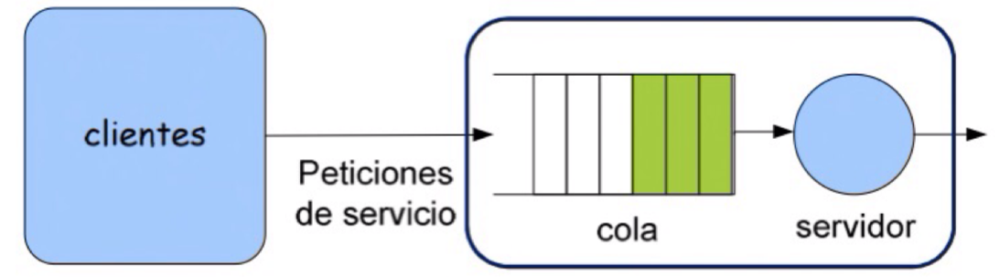
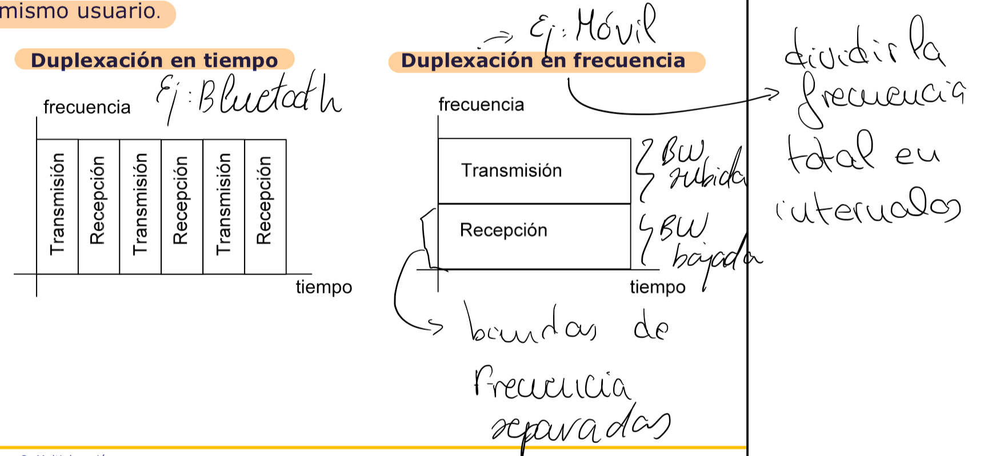
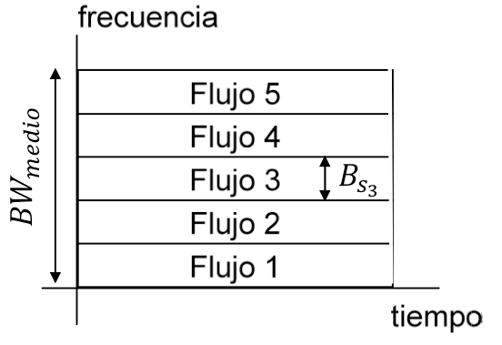
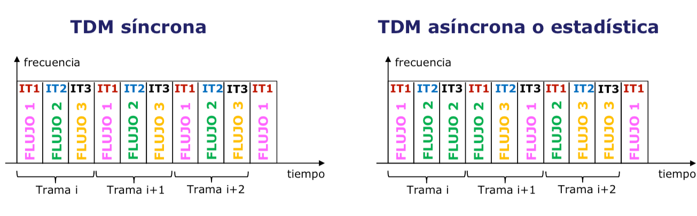
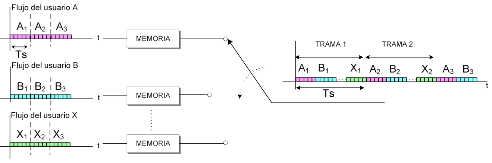
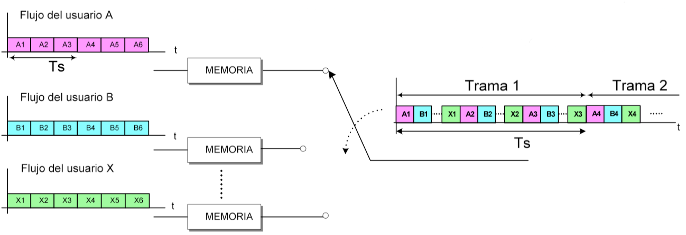
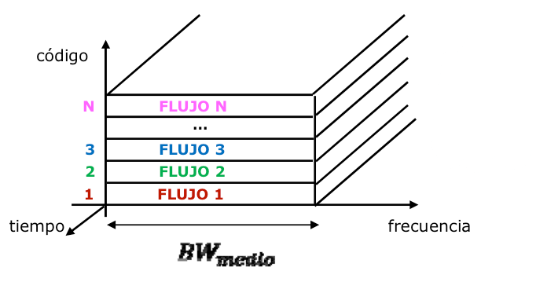
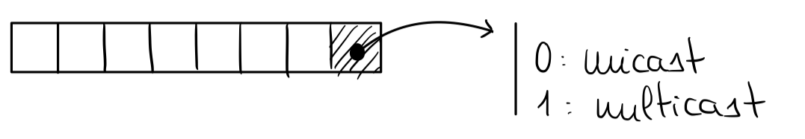
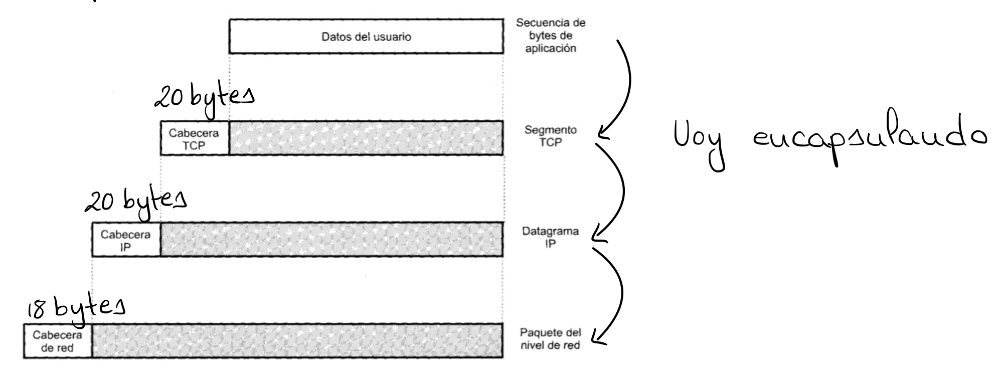

### Tema 1: Introducción a las Redes de Telecomunicaciones

#### 1.1. Introducción

La comunicación implica el intercambio de información (imagen, sonido, vídeo, etc.) en formato analógico o digital. Para ello, la información se convierte en señales, las cuales pueden ser:

- **Continuas**: toman cualquier valor.
- **Discretas**: toman un conjunto finito de valores.

La **amplitud** de las señales también es relevante:

- **No cuantificada**: toma cualquier valor.
- **Cuantificada**: toma valores enteros.

Según su naturaleza, las señales pueden ser:

- **Eléctricas**: circulan por un cable.
- **Radio**: transmitidas por el aire.
- **Ópticas**: se propagan a través de fibra óptica.

### 1.2. Características de las Señales

Las señales **analógicas** se caracterizan por su amplitud, frecuencia, fase y periodo. Las señales **digitales** se caracterizan por los bits (unidad mínima de información: 0 o 1), el tiempo de bit (tiempo necesario para transmitir un bit), el signo (conjunto de n bits) y el tiempo de signo (número de bits por el tiempo de bit).

El **régimen binario** es fundamental en la transmisión de señales, ya que representa el número de bits transmitidos por segundo.

### 1.3. Conversión de Señal Analógica a Digital

Las señales digitales presentan ventajas como la capacidad de compresión, control de errores, menor consumo, eficiencia en almacenamiento, menor degradación y transmisión a mayores distancias. Por tanto, es común convertir señales analógicas a digitales. Este proceso implica:

1. **Recopilación de la señal**.
2. **Muestreo** de la señal.
3. **Cuantificación** y **codificación**, generando una secuencia de bits.

Una **señal de banda base** es una señal analógica sin modulación. En el caso digital, se denomina **código de línea**. La **transmisión de banda base** ocurre cuando la señal se transmite en su rango de frecuencias original.

> **Modulación**: Multiplicación de una señal original por una sinusoide para cambiar su frecuencia a una portadora.

### 1.4. Sistema de Telecomunicación

Un sistema de telecomunicación comprende los elementos necesarios para intercambiar información entre un emisor y un receptor. Incluye:

- **Emisor**: genera la información.
- **Procesamiento de transmisión**: adapta la señal al canal.
- **Canal**: introduce retraso, distorsión y ruido.
- **Procesamiento de recepción**: recupera la señal original minimizando errores.
- **Receptor**: recibe la información.

#### 1.4.1. Sentido del Flujo

Según el sentido del flujo, un sistema de comunicación puede ser:

- **Simplex**: transmite en un solo sentido.
- **Half-duplex**: transmite en ambos sentidos, pero no simultáneamente.
- **Duplex**: transmite en ambos sentidos simultáneamente.

#### 1.4.2. Características del Canal de Comunicación

Parámetros importantes del canal de comunicación:

- **Ancho de banda de la señal**.
- **Ancho de banda del canal**: rango de frecuencias donde la transmisión es sin errores. Para una transmisión adecuada, el ancho de banda de la señal debe ser menor al del canal.
- **Capacidad**: cantidad máxima de bits que el canal puede transmitir. Para evitar errores, el régimen binario debe ser menor o igual a esta capacidad. La capacidad es producto de la eficiencia y el ancho de banda del canal.
- **Velocidad de propagación**: velocidad de la señal en el medio.
- **Tiempo de propagación**: tiempo que tarda la señal en llegar al destino.
- **Error**: ruidos o distorsiones que afectan la señal durante la transmisión. Para señales digitales, se usa la **BER** (Bit Error Rate) para medir la probabilidad de error en un bit.

#### 1.4.3. Medios de Transmisión

Los medios de transmisión pueden ser:

- **Guiados**: físicos, como cables de cobre o coaxiales.
- **No guiados**: inalámbricos, como señales de radio, microondas o luz.

Parámetros clave en la transmisión de ondas son la **frecuencia** y la **longitud de onda**. A mayor frecuencia, menor longitud de onda y mayor capacidad de información, pero con menos penetración en objetos.

Rangos de frecuencias utilizados:

- **MF (Medium Frequency)**: alcance de cientos de kilómetros.
- **HF (High Frequency)**: alcanza miles de kilómetros.
- **VHF (Very High Frequency) y UHF (Ultra High Frequency)**: alcance de hasta 40 km.
- **SHF (Super High Frequency)**: transmite vía satélite o terrestre hasta 40 km.

Tipos de transmisión:

- **Direccional**: en una única dirección.
- **Omnidireccional**: en múltiples direcciones.

### 1.5. Red de Telecomunicación

Una red de telecomunicación es una infraestructura que conecta usuarios (terminales) para ofrecer servicios. Se compone de:

- **Terminales**: generan y consumen información.
- **Sistemas de acceso**: conectan usuarios a la red.
- **Infraestructura**: elementos de la red que permiten la conexión y transporte de información.

#### 1.5.1. Topologías

Las redes pueden tener distintas topologías. La **red mallada** es robusta, pero implica un crecimiento exponencial de enlaces y posibles distancias prohibitivas a medida que se añaden usuarios.

#### 1.5.2. Organización de la Información a Transmitir

Los **mensajes** (conjuntos de bits) se agrupan en **paquetes** con cabecera (información de origen y destino) y cola (control de errores). Los mensajes largos pueden dividirse en múltiples paquetes.

#### 1.5.3. Difusión del Mensaje

La difusión dentro de la red puede ser:

- **Broadcast**: a todos los usuarios.
- **Multicast**: a múltiples usuarios.
- **Unicast**: a un solo usuario.
- **Anycast**: al usuario más cercano.

#### 1.5.4. Clasificación según el Área de Cobertura

Clasificación de redes según cobertura:

- **PAN (Personal Area Network)**: ej. NFC, Bluetooth.
- **LAN (Local Area Network)**: ej. red doméstica.
- **MAN (Metropolitan Area Network)**: ej. red de una universidad.
- **WAN (Wide Area Network)**: ej. Internet.

#### 1.5.5. Clasificación según Localización del Terminal

Las redes pueden ser **fijas** o **móviles** según la localización del terminal. También pueden ser **terrestres** (nodos y terminales en tierra), **satelitales** (nodos en satélites) o **espaciales** (nodos fuera de la Tierra).

#### 1.5.6. Clasificación según el Modelo de Comunicación

Los sistemas pueden ser:

- **De difusión**: los terminales comparten el medio y filtran los mensajes.
- **De conmutación**: se establece una conexión previa entre emisor y receptor.

Ejemplo: **Internet** sigue una topología jerárquica o en árbol con niveles de acceso y transporte.

#### 1.5.7. Técnicas de Conmutación

Tipos de conmutación:

- **Conmutación de circuitos**: conexión física establecida antes de la transmisión. Utilizado en redes telefónicas.
  - Ventaja: transmisión rápida una vez establecida la conexión.
  - Desventajas: tiempo de espera para establecer conexión y uso ineficiente de recursos.
- **Conmutación de paquetes**: paquetes en cola y retransmisión en caso de error. Puede ser:
  - **Mediante datagramas**: paquetes no ordenados que siguen caminos distintos.
  - **Mediante circuito virtual**: primer paquete establece el camino; los demás siguen el mismo.

#### 1.5.8. Orientado a Conexión

Un sistema **orientado a conexión** establece una conexión previa, lo que aumenta la fiabilidad y permite control de flujo y errores, aunque no es óptimo para redes con alta latencia.

#### 1.5.9. Indicadores

Indicadores clave en redes de telecomunicaciones:

- **Latencia**: tiempo que tarda un paquete en ser procesado.
- **Throughput**: número de bits transmitidos en un instante.
- **Jitter**: variación del retardo entre paquetes de un mismo mensaje.

#### 1.5.10. Problemas de las Comunicaciones

Problemas comunes en sistemas de comunicación:

- **Direccionamiento**: identificar usuarios.
- **Multiplexación**: uso eficiente de recursos.
- **Dimensionado**: calcular enlaces requeridos.
- **Señalización**: conocer el estado de la red.

En comunicaciones móviles, surgen problemas adicionales como **roaming**, **handover**, **paging** y **actualización de localizaciones**. En Internet, se deben gestionar también la **calidad de experiencia (QoE)**, **encaminamiento** y **control de flujo**.

# Tema 2: Principios sobre Dimensionado de Redes y Sistemas de Colas

### 2.1. Definiciones

En el contexto de redes de telecomunicaciones, una **cola** se refiere a un área designada para almacenar solicitudes de clientes que llegan a un servidor cuando este se encuentra en un estado de alta demanda y no puede procesar más peticiones de inmediato. La presencia de colas se convierte en un elemento crucial en el diseño de sistemas de comunicación, ya que permite gestionar el flujo de solicitudes en función de la capacidad del sistema.

El **dimensionado del sistema** se refiere al proceso de determinar la capacidad óptima del sistema para un nivel de uso previsto, con el fin de optimizar el rendimiento de la red y maximizar la satisfacción del usuario. Los objetivos principales del dimensionado de redes son minimizar la **latencia** (el tiempo de espera para que una solicitud sea procesada) y maximizar el **throughput** (la tasa a la cual se completan las solicitudes).

En la imagen anterior, podemos observar cómo funciona el proceso de encolado de solicitudes. Cuando un usuario envía solicitudes a un servidor, estas solicitudes pueden ser encoladas y luego procesadas por el servidor de acuerdo con un conjunto de reglas predefinidas.

### 2.2. Componentes de un Sistema de Colas

El funcionamiento de un sistema de colas puede desglosarse en tres partes: el **cliente**, la **cola** y el **servicio**.

#### Parte del Cliente

1. **Número de clientes**:
   - Puede ser **finito** (cuando hay un número limitado de clientes potenciales) o **infinito** (cuando el número de clientes es ilimitado).

2. **Peticiones**:
   - Pueden ser de naturaleza **determinista** (siguen un patrón predecible) o **aleatoria** (siguen una distribución de probabilidad, típicamente representada como una esperanza o media).

3. **Tiempo entre llegadas de las solicitudes**:
   - El intervalo de tiempo transcurrido entre dos peticiones consecutivas. Este puede variar y es crucial para el análisis del sistema de colas.

4. **Tasa media de llegada** (\(\lambda\)):
   - Representa el número de solicitudes que llegan al sistema por unidad de tiempo. Es una medida clave para evaluar la carga del sistema.

#### Parte de la Cola

1. **Capacidad de la cola**:
   - Puede ser **finita** (cuando hay un límite en la cantidad de solicitudes que se pueden almacenar en la cola) o **infinita** (cuando no hay límite en el número de solicitudes en espera).

2. **Tiempo de espera en la cola**:
   - El tiempo promedio que una solicitud permanece en la cola antes de ser procesada.

3. **Número de solicitudes en cola**:
   - La cantidad de solicitudes que están en la cola en un momento determinado. Esta métrica ayuda a entender la congestión en el sistema.

#### Parte del Servicio

1. **Número de servidores**:
   - Puede haber uno o más servidores disponibles para procesar las solicitudes en cola. La configuración de los servidores puede variar dependiendo del diseño del sistema.

2. **Tasa de servicio** (\(\mu\)):
   - Indica el número de solicitudes que un servidor puede procesar por unidad de tiempo. Junto con la tasa de llegada, es crucial para analizar el rendimiento del sistema de colas.

3. **Tiempo de servicio**:
   - Es el tiempo requerido para que el servidor complete el procesamiento de una solicitud.

#### Parte del Sistema en su Conjunto

1. **Número total de solicitudes en el sistema**:
   - Incluye tanto las solicitudes en cola como las que están siendo procesadas por el servidor en un momento dado.

2. **Tiempo total en el sistema**:
   - Es el tiempo total transcurrido desde que una solicitud es enviada hasta que se recibe la respuesta. Este tiempo incluye tanto el tiempo de espera en la cola como el tiempo de servicio.

#### Modelado Matemático de un Sistema de Colas

- Si modelamos el sistema considerando el **tiempo de espera en la cola**, la distribución del sistema suele ser **exponencial**.
- Si modelamos el sistema considerando la **tasa media de llegada** (\(\lambda\)), entonces el sistema sigue una **distribución de Poisson**.

#### Intensidad del Sistema de Colas

Otro aspecto crucial en los sistemas de colas es la **intensidad del tráfico** (\(\rho\)), que se define como:

$$
\rho = \frac{\lambda}{\mu}
$$

donde:

- $\lambda$ es la tasa media de llegada.
- $\mu$ es la tasa de servicio.

La intensidad del tráfico representa el número promedio de solicitudes en el sistema mientras una solicitud es procesada. Si \(\rho\) es mayor o igual a la capacidad del sistema, significa que el sistema está **mal dimensionado** y no puede manejar la carga de solicitudes eficientemente, lo que puede llevar a tiempos de espera elevados y posibles pérdidas de solicitudes.

# Tema 3: Multiplexación

### 3.1. Introducción

La **multiplexación** es una técnica que permite la compartición de recursos, lo que resulta en un uso más eficiente del medio de transmisión y, por lo tanto, en un ahorro de costes. Esta técnica permite transmitir simultáneamente múltiples flujos de información a través de un mismo medio físico. 

La multiplexación se puede clasificar en dos formas principales:

1. **Multiplexación mediante un dispositivo multiplexor**: Este método se utiliza cuando los usuarios generan señales que no son directamente compatibles para su combinación. Un ejemplo de este tipo es la tecnología **ADSL**.
   
2. **Multiplexación sin un dispositivo multiplexor**: En este caso, los usuarios generan información en un formato que permite su separación sin la necesidad de un multiplexor. Un ejemplo común es la transmisión de **radio FM**.

La **duplexación** es una variante de la multiplexación que se refiere a la combinación de los flujos de transmisión y recepción de un mismo usuario en un canal o medio de comunicación.

Además, la **canalización o acceso múltiple** es una forma de multiplexación donde la relación entre los flujos de información y los canales asignados varía con el tiempo, siendo especialmente común en los sistemas de comunicación móvil.

#### Nomenclatura de Multiplexación y Canalización

Se distinguen tres enfoques principales:

1. **Multiplexación**:
   - **FDM** (Frequency Division Multiplexing): Multiplexación por División de Frecuencia.
   - **TDM** (Time Division Multiplexing): Multiplexación por División de Tiempo.
   - **CDM** (Code Division Multiplexing): Multiplexación por División de Código.

2. **Canalización**:
   - **FDMA** (Frequency Division Multiple Access): Acceso Múltiple por División de Frecuencia.
   - **TDMA** (Time Division Multiple Access): Acceso Múltiple por División de Tiempo.
   - **CDMA** (Code Division Multiple Access): Acceso Múltiple por División de Código.

3. **Duplexación**:
   - **FDD** (Frequency Division Duplexing): Duplexación por División de Frecuencia.
   - **TDD** (Time Division Duplexing): Duplexación por División de Tiempo.
   - **CDD** (Code Division Duplexing): Duplexación por División de Código (no se utiliza debido a problemas de saturación).

### 3.2. Multiplexación por División en Frecuencia (FDM)

La **multiplexación por división de frecuencia** (FDM) consiste en asignar a cada flujo de información una banda de frecuencia diferente dentro del medio de transmisión. Esto permite que estos flujos se transmitan de manera simultánea sin interferencias, siempre y cuando se respeten las bandas de frecuencia asignadas.

En la práctica, todas las señales que se desean multiplexar ocupan la misma banda de frecuencias. Para permitir su transmisión simultánea, se realiza una traslación de banda mediante modulación para mover cada señal a una frecuencia portadora diferente.

#### Desventajas de la FDM

- **Elevada PAPR (Peak to Average Power Ratio)**: Esto puede limitar la distancia de transmisión, ya que señales con alta PAPR son más susceptibles a distorsiones.
- **Intermodulación entre canales**: La superposición de señales en la misma banda puede generar interferencias que afectan la calidad de transmisión.
- **Ineficiencia en el uso del espectro debido a las bandas de guarda**: Se deben asignar bandas de guarda para evitar la interferencia entre señales, lo que puede llevar a un uso subóptimo del espectro.

Cuando se aplica FDM a transmisiones en fibra óptica, se conoce como **multiplexación por división en longitud de onda** (WDM), que permite maximizar la capacidad de transmisión de las fibras ópticas transmitiendo múltiples señales en diferentes longitudes de onda.

### 3.3. Multiplexación por División en Tiempo (TDM)

La **multiplexación por división de tiempo** (TDM) asigna a cada flujo de información el ancho de banda total del medio de transmisión durante una fracción de tiempo que se repite periódicamente. Es especialmente adecuada para señales digitales y permite un uso eficiente del ancho de banda del medio.

En TDM, la información se organiza en tramas que contienen intervalos de tiempo, cada uno asociado a un canal físico. Esto permite que el canal físico transporte información de uno o más flujos de datos. 

#### Tipos de TDM

- **TDM Síncrona**: La capacidad asignada a cada flujo es constante.
- **TDM Asíncrona**: La capacidad varía con el tiempo según la demanda.

#### Métodos de Entrelazado en TDM

1. **Entrelazado de palabra**: La información se organiza en palabras (conjunto de bits).

    
    
2. **Entrelazado de bit**: La información se entrelaza a nivel de bits.

    
    
El proceso de **demultiplexación** implica identificar los bits correspondientes a cada intervalo mediante una marca de alineación de trama (FAS, Frame Alignment Signal), que se puede implementar mediante un código de línea o una secuencia de bits.

### 3.4. Multiplexación por División en Código (CDM)

La **multiplexación por división de código** (CDM) asigna a cada flujo de información todo el ancho de banda disponible en el medio de transmisión durante todo el período de transmisión. Se utilizan señales especiales, conocidas como **códigos**, para lograr este compartimiento efectivo del ancho de banda.

#### Ortogonalización de Señales

La multiplexación en tiempo y frecuencia son casos específicos de **ortogonalización de señales**. Dos señales son **ortogonales** cuando sus valores no coinciden en tiempo o frecuencia, lo que significa que su producto escalar es cero. Esta propiedad es crucial para evitar la interferencia entre señales y permitir su recuperación de manera independiente.

# Tema 4: Técnicas de Acceso al Medio

### 4.1. ¿Qué es una colisión?

En redes donde el medio de transmisión es compartido entre múltiples terminales, existe la posibilidad de que las señales de diferentes usuarios coincidan en el tiempo. Esto puede llevar a una **colisión**, un fenómeno que ocurre cuando las señales de dos o más terminales se superponen en el medio de transmisión al mismo tiempo, impidiendo su correcta interpretación. 

Cuando se produce una colisión, el receptor recibe señales simultáneas, resultando en un nivel de señal más alto de lo normal. En redes cableadas, esto se manifiesta como una señal con casi el doble de energía esperada. En redes inalámbricas, la señal recibida suele ser de baja energía debido a interferencias. El transmisor detecta la colisión gracias a la ausencia o al error en las señales de confirmación de recepción (ACK) enviadas por el receptor. En estos casos, los terminales deben gestionar las colisiones para minimizar la pérdida de datos y optimizar el rendimiento de la red.

### 4.2. Técnicas de Acceso Aleatorio

Las técnicas de acceso aleatorio son métodos utilizados en redes compartidas para gestionar el acceso al medio de transmisión y minimizar las colisiones. Estas técnicas no requieren una coordinación centralizada y permiten que los terminales transmitan datos basándose en ciertas reglas. A continuación se detallan cuatro técnicas principales: Aloha, CSMA, CSMA/CD, y CSMA/CA.

#### 1. **Aloha**

- **Funcionamiento**: Aloha es una técnica simple donde los dispositivos transmiten datos en cualquier momento sin coordinación central. Si ocurre una colisión (es decir, dos o más dispositivos transmiten simultáneamente), los dispositivos involucrados esperan un tiempo aleatorio antes de reintentar la transmisión.
- **Ventajas**: Es fácil de implementar y no requiere sincronización compleja.
- **Desventajas**: Es propenso a colisiones debido a la falta de control sobre cuándo pueden transmitir los dispositivos, lo que puede llevar a un uso ineficiente del canal.

#### 2. **CSMA (Carrier Sense Multiple Access)**

- **Funcionamiento**: En CSMA, los dispositivos deben "escuchar" el medio de transmisión (detectar la portadora) antes de transmitir. Si el canal está libre, el dispositivo transmite. Si el canal está ocupado, el dispositivo espera un tiempo aleatorio antes de intentar transmitir nuevamente.
- **Ventajas**: Reduce el número de colisiones en comparación con Aloha, ya que los dispositivos solo transmiten cuando el canal está libre.
- **Desventajas**: Las colisiones aún pueden ocurrir debido a los **retardos de propagación**, es decir, el tiempo que tarda una señal en viajar desde el transmisor al receptor. Durante este tiempo, otro dispositivo puede comenzar a transmitir, causando una colisión.

#### 3. **CSMA/CD (Carrier Sense Multiple Access with Collision Detection)**

- **Funcionamiento**: Utilizado principalmente en redes Ethernet cableadas. Además de escuchar el canal antes de transmitir, los dispositivos también escuchan mientras transmiten. Si se detecta una colisión (dos señales simultáneas), la transmisión se detiene inmediatamente, y los dispositivos esperan un tiempo aleatorio antes de volver a intentarlo.
- **Ventajas**: Es eficiente para la detección y manejo de colisiones en redes cableadas, ya que las colisiones se detectan rápidamente y los dispositivos pueden responder en consecuencia.
- **Desventajas**: Es menos relevante en redes modernas como **Ethernet Gigabit** y superiores, donde la arquitectura de la red utiliza principalmente **conmutación** en lugar de compartir un solo medio. Las redes modernas de alta velocidad suelen utilizar CSMA/CA o tecnologías avanzadas de conmutación que eliminan la necesidad de CSMA/CD.

#### 4. **CSMA/CA (Carrier Sense Multiple Access with Collision Avoidance)**

- **Funcionamiento**: Utilizado en redes inalámbricas, como Wi-Fi. En CSMA/CA, los dispositivos escuchan el canal para verificar si está libre antes de transmitir. Si el canal está ocupado, el dispositivo espera un tiempo aleatorio antes de intentarlo nuevamente. A diferencia de CSMA/CD, donde las colisiones se detectan después de ocurrir, CSMA/CA intenta evitar las colisiones antes de que ocurran. Utiliza un mecanismo de "espera antes de transmitir" y a menudo requiere que los dispositivos soliciten permiso antes de transmitir.
- **Ventajas**: Es eficaz para evitar colisiones en redes inalámbricas, donde la detección de colisiones es más difícil debido a la naturaleza del medio. En redes inalámbricas, la señal de un transmisor puede no ser lo suficientemente fuerte como para ser detectada por otro transmisor, causando el problema de "terminal oculto".
- **Desventajas**: Agrega sobrecarga de control, lo que puede reducir la eficiencia en redes congestionadas.

#### Comparación de las Técnicas de Acceso Aleatorio

| Técnica | Ventajas | Desventajas | Uso Principal |
|--------|----------|-------------|---------------|
| **Aloha** | Simple, fácil de implementar | Alta tasa de colisiones | Redes primitivas, sistemas de baja capacidad |
| **CSMA** | Reduce colisiones comparado con Aloha | Colisiones aún posibles por retardos | Redes de área local (LAN) |
| **CSMA/CD** | Detecta y maneja colisiones eficientemente | Menos relevante en redes modernas | Ethernet cableada tradicional |
| **CSMA/CA** | Evita colisiones en redes inalámbricas | Sobrecarga de control, menos eficiente en alta congestión | Redes Wi-Fi, redes inalámbricas |

# Tema 5: Control de Errores

### 5.1. Objetivos

El objetivo principal de cualquier sistema de comunicación es garantizar la **fiabilidad** y la **eficiencia** en la transmisión de datos. Sin embargo, los canales de comunicación son propensos a errores debido a **interferencias**, **ruido** y otras distorsiones. Para medir la calidad de una transmisión, utilizamos la **tasa de error de bits (BER, por sus siglas en inglés)**, que se define como el número de bits erróneos dividido por el número total de bits transmitidos. Un valor más bajo de BER indica una mejor calidad de comunicación.

Para mitigar los errores introducidos por el canal de transmisión, se utilizan estrategias que incorporan **redundancia de información** y sistemas de control que permiten la recuperación de los datos originales. Estos sistemas de control de errores se dividen en dos categorías principales:

1. **ARQ (Automatic Repeat reQuest o Solicitud de Repetición Automática):**
   - **Funcionamiento**: Los sistemas ARQ detectan errores en los paquetes de datos recibidos y solicitan la retransmisión del paquete cuando se encuentra un error. Utilizan mecanismos como el **ACK** (acknowledgment) para confirmar la recepción correcta y el **NAK** (negative acknowledgment) para señalar la recepción incorrecta.
   - **Ventajas**: Son simples y eficaces en redes con retardo de propagación moderado, donde la retransmisión no introduce un retraso significativo.
   - **Desventajas**: En situaciones donde el retardo de propagación es grande o la retransmisión introduce demoras considerables (como en redes satelitales o móviles), el método puede no ser eficiente.
   
2. **FEC (Forward Error Correction o Corrección de Errores Adelantada):**
   - **Funcionamiento**: Los sistemas FEC introducen redundancia adicional en los datos transmitidos de modo que el receptor pueda **detectar y corregir** errores sin la necesidad de solicitar una retransmisión. Esto es posible a través de códigos correctores de errores, como los códigos de Hamming, Reed-Solomon, o LDPC (Low-Density Parity-Check).
   - **Ventajas**: Es particularmente útil en escenarios donde no se dispone de un canal de retorno, la retransmisión no es factible (por ejemplo, en transmisiones unidireccionales como las transmisiones de TV satelital) o el tiempo de respuesta es crítico.
   - **Desventajas**: Añade una sobrecarga significativa al flujo de datos debido a la necesidad de redundancia, lo que puede reducir la eficiencia de la transmisión.

Es fundamental seleccionar el tipo de control de errores adecuado según el entorno de la red y las necesidades del sistema. En algunos casos, se pueden utilizar combinaciones de ARQ y FEC para optimizar tanto la **eficiencia** como la **fiabilidad** de la comunicación.

#### Tipos de Errores

Los errores en las transmisiones de datos se pueden clasificar en dos tipos principales:

1. **Errores Simples**:
   - Ocurren cuando un único bit se transmite incorrectamente, cambiando de un `0` a un `1` o viceversa.
   - Su probabilidad suele ser baja en comparación con los errores a ráfagas, pero su manejo es fundamental para sistemas con alta sensibilidad a la calidad de transmisión.

2. **Errores a Ráfagas**:
   - Afectan a múltiples bits consecutivos en un solo evento de error. Pueden ser causados por interferencias continuas, como ruido impulsivo o distorsiones de señal.
   - Son más complejos de manejar, ya que requieren técnicas avanzadas de corrección de errores para ser corregidos eficazmente. Códigos como **Reed-Solomon** son especialmente eficaces para este tipo de errores.

### 5.2. Métodos de Detección y Corrección de Errores

#### 1. **Detección de Errores**

- **Bits de Paridad**: Un método sencillo en el que se añade un bit extra a los datos que se envían, para que el número total de bits `1` sea par (paridad par) o impar (paridad impar). Es eficaz para detectar errores simples, pero inadecuado para errores a ráfagas.
  
- **Checksum**: Un método en el que los datos se dividen en palabras de longitud fija y se suman. El resultado (checksum) se envía junto con los datos. El receptor recalcula el checksum y lo compara con el recibido. Este método es más robusto que el de bits de paridad.

- **CRC (Cyclic Redundancy Check)**: Un método de detección muy robusto que utiliza divisiones polinómicas para detectar errores en grandes bloques de datos. Los CRC pueden detectar errores simples, múltiples, errores en ráfagas y errores aleatorios.

#### 2. **Corrección de Errores**

- **Códigos de Hamming**: Permiten la corrección de errores simples y la detección de errores dobles mediante el uso de bits de paridad distribuidos en posiciones específicas. Son adecuados para situaciones donde los errores simples son comunes.
  
- **Códigos Reed-Solomon**: Muy eficaces para corregir errores a ráfagas. Son ampliamente utilizados en discos compactos (CD), DVDs, transmisión de datos espaciales y comunicaciones digitales debido a su capacidad para manejar errores de bits consecutivos.

- **LDPC (Low-Density Parity-Check)**: Códigos de corrección de errores avanzados que ofrecen una alta eficiencia y rendimiento cerca del límite de Shannon. Se utilizan en sistemas de comunicaciones modernos como Wi-Fi, LTE y DVB-S2.

# Tema 6: Encaminamiento

El **encaminamiento** es el proceso de dirigir un paquete de datos desde su origen hasta su destino a través de una red. Para llevar a cabo este proceso, se utilizan **tablas de encaminamiento**, que son registros que contienen información sobre las rutas disponibles hacia distintos nodos de la red. Estas tablas permiten a cada nodo decidir cómo enviar los datos a través de la red para alcanzar su destino de manera eficiente.

### Tipos de Tablas de Encaminamiento

1. **Tablas Estáticas**:
   - Son configuradas manualmente por el administrador de la red.
   - Adecuadas para redes pequeñas y estables donde no se producen muchos cambios en la topología.
   - **Ventajas**: Simplicidad de configuración y ausencia de tráfico de actualización de tablas.
   - **Desventajas**: Falta de adaptabilidad a cambios en la red, lo que puede llevar a ineficiencias o fallos de comunicación si la topología cambia.

2. **Tablas Dinámicas**:
   - Se actualizan automáticamente mediante protocolos de encaminamiento.
   - Son más adecuadas para redes grandes y complejas donde las rutas pueden cambiar con frecuencia.
   - **Ventajas**: Adaptabilidad y respuesta rápida a cambios en la red.
   - **Desventajas**: Generan tráfico de control adicional y requieren más recursos de procesamiento.

### 6.1. Forwarding y Routing

- **Routing (Encaminamiento)**: Proceso que consiste en determinar la mejor ruta para transmitir datos desde el origen hasta el destino. Esto implica la actualización de las tablas de encaminamiento mediante protocolos específicos que calculan rutas óptimas.
  
- **Forwarding (Envío)**: Acción de enviar un paquete a su destino a través de la red. Los routers utilizan sus tablas de encaminamiento para decidir hacia dónde deben enviar los paquetes en cada paso del camino.

#### 6.1.1. Métodos de Forwarding

1. **Ruta (Route Method)**: Las tablas de encaminamiento contienen información detallada sobre la ruta completa hasta el destino.
2. **Next-hop (Próximo Salto)**: Solo se almacena el próximo salto hacia el destino, en lugar de toda la ruta.
3. **Host-specific (Específico del Host)**: Hay una entrada por cada terminal conectada a la red, lo que permite una segmentación detallada.
4. **Network-specific (Específico de la Red)**: Contiene una entrada por cada red, simplificando el encaminamiento para grupos de terminales similares.
5. **Default (Predeterminado)**: Define una ruta predeterminada que se utiliza cuando no hay coincidencias específicas en la tabla de encaminamiento.

#### 6.1.2. Características del Routing

Para que el protocolo de encaminamiento sea eficaz, debe cumplir con las siguientes características:

- **Correcto**: Debe encontrar rutas válidas y efectivas.
- **Simple**: Minimizar la carga computacional y el tráfico de control.
- **Robusto**: Capacidad para manejar fallos en la red y mantener la conectividad.
- **Estable**: Mantener rutas consistentes en un entorno de red cambiante.
- **Óptimo**: Maximizar la eficiencia en términos de tiempo, distancia, consumo de energía u otros criterios.

#### 6.1.3. Clasificación de los Protocolos de Routing

Existen diferentes tipos de protocolos de encaminamiento que pueden clasificarse según distintos criterios:

1. **Por Tipo de Control de Ruta**:
   - **Hop-by-Hop (Salto a Salto)**: Cada nodo decide el siguiente salto basándose en su tabla de encaminamiento.
   - **Source Routing (Definición de Ruta en la Fuente)**: La fuente especifica toda la ruta que debe seguir el paquete.

2. **Por Adaptabilidad a Cambios en la Red**:
   - **Enrutamiento Estático**: Las rutas se configuran manualmente y no cambian automáticamente.
   - **Enrutamiento Dinámico**:
     - **Centralizado**: Un nodo central gestiona todas las rutas y distribuye la información a los demás nodos.
     - **Distribuido**: Cada nodo calcula su propia tabla de encaminamiento en función de la información que recibe de los demás nodos. Este enfoque es más robusto y adaptativo.

#### 6.1.4. Redes Orientadas a la Conexión vs. Redes No Orientadas a la Conexión

- **Redes Orientadas a la Conexión**:
  - Se establece una ruta fija (circuito virtual) para toda la comunicación entre la fuente y el destino.
  - Utilizado en sistemas como ATM (Modo de Transferencia Asíncrona) o MPLS (Conmutación de Etiquetas Multiprotocolo).

- **Redes No Orientadas a la Conexión**:
  - Cada paquete es independiente y se encamina según la mejor ruta disponible en ese momento.
  - Ejemplo clásico es el enrutamiento en Internet (basado en IP), donde cada paquete puede seguir rutas diferentes para llegar al mismo destino.

# Tema 7: Modelos de referencia

### 7.1. Introducción

Para abordar la complejidad de las redes, se agrupan funcionalidades relacionadas para crear un modelo de referencia. Estas arquitecturas organizan funciones en unidades llamadas capas, lo que facilita la comunicación entre dispositivos de diferentes fabricantes.

### 7.2. Arquitectura en capas

#### 7.2.1. Descripción

El enfoque de arquitectura en capas organiza las funciones de una red en grupos relacionados, conocidos como capas. Cada capa proporciona servicios a la capa superior y utiliza servicios de la capa inferior. Por ejemplo, la capa 2 proporciona servicios a la capa 3, que a su vez los transmite a la capa 4.

Además, una capa N de un equipo puede comunicarse con otra capa N de un equipo diferente mediante protocolos específicos. Este enfoque simplifica el diseño, facilita las modificaciones, permite la división de tareas en paralelo y mejora la interoperabilidad, permitiendo que diferentes fabricantes sigan un modelo común.

#### 7.2.2. Protocolos

Los protocolos son conjuntos de reglas que regulan el intercambio de datos entre diferentes entidades. Se caracterizan por:

- **Semántica**: Define el significado de cada sección de bits en la comunicación.
- **Sintaxis**: Establece el formato de los datos, incluyendo el número y disposición de los campos en la cabecera.
- **Temporización**: Determina la secuencia en la que se envían y reciben los mensajes.

Las entidades dentro de una misma capa se comunican mediante Unidades de Datos de Protocolo (PDU), que incluyen una cabecera de control y, generalmente, datos de usuario presentados como Unidades de Datos de Servicio (SDU). La comunicación entre procesos en el mismo nivel es virtual, sin enlaces directos, utilizando servicios de capas inferiores. Cada nivel recibe Peticiones de Servicios de Aplicación (ASP) del nivel superior, las encapsula en PDUs y las envía a la entidad correspondiente en el sistema receptor.

### 7.3. Modelo OSI

El modelo OSI permite la comunicación entre sistemas diversos, independientemente de su arquitectura. Está compuesto por siete capas organizadas jerárquicamente:

1. **Capa de Aplicación**: Proporciona servicios de red a las aplicaciones del usuario, como HTTP para la web.
2. **Capa de Presentación**: Se encarga de la traducción, cifrado y compresión de datos.
3. **Capa de Sesión**: Gestiona la apertura, mantenimiento y cierre de sesiones de comunicación.
4. **Capa de Transporte**: Garantiza la entrega fiable y ordenada de datos mediante protocolos como TCP y UDP.
5. **Capa de Red**: Se ocupa del enrutamiento y direccionamiento de datos en la red.
6. **Capa de Enlace de Datos**: Maneja la transmisión de datos a nivel de enlace físico, garantizando la integridad y resolviendo colisiones.
7. **Capa Física**: Define la transmisión de bits a través del medio físico, especificando cables, voltajes y frecuencias.

Cada capa tiene funciones específicas y colabora con las demás para permitir la comunicación eficiente entre sistemas heterogéneos.

#### 7.3.1. Organización de los niveles

Los niveles en el modelo OSI se organizan en tres categorías:

1. **Niveles de Soporte de Red**: Comprende las capas física, de enlace y de red. Se enfocan en la infraestructura para el transporte de información.
2. **Niveles de Servicios de Soporte de Usuario**: Incluye las capas de sesión, presentación y aplicación. Facilitan la comunicación y el intercambio de información entre diferentes aplicaciones.
3. **Nivel de Transporte**: Se centra en la transmisión fiable de datos de extremo a extremo, superando posibles obstáculos.

#### 7.3.2. Direcciones MAC

Cada dispositivo conectado a la red posee una dirección MAC única de 6 bytes, que identifica su tarjeta de interfaz de red. El bit menos significativo del primer byte indica si la dirección es unicast o multicast. La dirección de broadcast es FF:FF:FF:FF:FF:FF.

#### 7.3.4. Equipos de interconexión

Los principales elementos de una red son:

1. **Repetidor**: Regenera o amplifica señales para extender la cobertura de la red. Opera en la capa física.
2. **Puente (Bridge)**: Filtra tráfico entre puertos en la capa de enlace, dividiendo la red en segmentos. Reenvía mensajes basados en direcciones MAC.
3. **Router**: Opera en la capa de red y toma decisiones de enrutamiento basadas en la topología de la red.
4. **Conmutador (Switch)**: Funciona en las capas de enlace y red, mapeando direcciones IP a puertos para reenviar mensajes eficientemente.
5. **Pasarela (Gateway)**: Opera en capas superiores a la de red, traduciendo entre dominios de red diferentes.
   
### 7.4. TCP/IP

El modelo TCP/IP consta de cuatro capas:

1. **Capa de Aplicación**: Facilita la comunicación entre procesos en terminales separados y proporciona servicios directamente utilizados por las aplicaciones.
2. **Capa de Transporte**: Ofrece transferencia de datos de extremo a extremo, garantizando entrega fiable y en orden.
3. **Capa de Internet**: Gestiona el enrutamiento de datos a través de redes interconectadas.
4. **Capa de Acceso a la Red**: Asegura la comunicación entre el sistema final y la red, manejando la transmisión básica de datos.

#### 7.4.1. Encapsulamiento

El proceso de encapsulamiento en el modelo TCP/IP implica que cada capa añade su propia información de control a los datos transmitidos.

#### 7.4.2. TCP/IP vs OSI

- El modelo OSI especifica funciones para cada capa, mientras que TCP/IP contiene protocolos que pueden coincidir o mezclarse según las necesidades del sistema.
- TCP/IP se establece antes que OSI; por lo tanto, cambiar a OSI sería costoso.
- Internet se construye sobre el conjunto de protocolos TCP/IP.

#### 7.4.3. Modelos de capas, Cross-layer y Layer-less

En el enfoque **Cross-layer**, se permite la comunicación directa entre protocolos de capas no contiguas, intercambiando información entre estas capas. En el concepto **Layer-less**, se busca consolidar funciones en una misma capa, reduciendo el número de niveles en el modelo de comunicación.

# Tema 8: Redes de Telecomunicación

### 8.1. Internet: La Arquitectura de la Red

Internet es una red descentralizada que conecta diversas redes mediante routers y otros elementos clave:

#### 8.1.1. Componentes de la Arquitectura de la Red

1. **Hosts**: Son dispositivos como computadoras personales, dispositivos móviles y servidores que se conectan a través de redes locales (LAN) y redes de área amplia (WAN).
2. **Routers**: Dispositivos fundamentales que interconectan redes y encaminan paquetes de datos de manera eficiente.
3. **Proveedor de Servicio de Internet (ISP)**: Empresas que proporcionan acceso a Internet mediante servidores conectados a Internet a través de enlaces de alta velocidad. Asignan direcciones IP a los clientes y operan equipos y enlaces de telecomunicación en Puntos de Presencia (POPs).
4. **Puntos de Presencia (POPs)**: Puntos de conexión donde se establece la frontera de la red del ISP con los clientes. Los ISPs distribuyen POPs para facilitar el acceso a Internet.
5. **Puntos de Acceso a la Red (NAP, IXP)**: Servicios que permiten la conmutación a gran escala y la interconexión entre redes.
6. **Proveedor de Servicio de Red (NSP)**: Empresas que proporcionan infraestructura de telecomunicaciones a los ISPs. Algunas empresas operan tanto como ISP como NSP.

#### 8.1.2. Capa IP y su Funcionamiento

La capa IP (Protocolo de Internet) es crucial en Internet. Es no orientada a la conexión y se encarga de fragmentar y ensamblar datos en datagramas. Estos datagramas incluyen información de control y el payload, que es la información transmitida.

### 8.2. GSM

#### 8.2.1. Problemática de las Redes Móviles

Las redes móviles enfrentan varios desafíos:

1. **Limitaciones de Espectro Radioeléctrico**: La movilidad de los dispositivos requiere transmisión por radio, y el espectro radioeléctrico es limitado. Esto puede causar interferencias que afectan la calidad de la comunicación.
2. **Potencia de Transmisión en Dispositivos Terminales**: Una potencia de transmisión inadecuada puede resultar en cobertura insuficiente o conexiones de baja calidad.
3. **Cobertura de Estaciones Base**: El territorio se divide en celdas, cada una con una estación base. La gestión eficiente de estas estaciones es crucial para una conectividad adecuada.
4. **Sistema Celular**: Las redes móviles se organizan en celdas, cada una con una estación base. La reutilización de canales debe considerar las interferencias cocanal, lo que representa un desafío en la asignación de recursos.

#### 8.2.2. Geometría de las Celdas

El diseño de las celdas en redes móviles debe:

- **Eliminar Solapamientos**: Evitar superposiciones entre celdas para prevenir interferencias y problemas de calidad de señal.
- **Prevenir Zonas de Sombra**: Asegurar cobertura efectiva en toda el área de cada celda.
- **Maximizar el Área de la Celda**: Ampliar la cobertura sin comprometer la calidad de la señal, mediante una distribución estratégica de estaciones base y antenas.

#### 8.2.3. Reutilización de los Canales

La reutilización de canales es crucial para gestionar el espectro de frecuencia disponible:

- **Asignación Eficiente de Canales**: Asignar canales de frecuencia de forma que las celdas cercanas no utilicen los mismos, reduciendo interferencias.
- **Optimización de la Reutilización**: Emplear estrategias para minimizar interferencias cocanal al reutilizar canales en diferentes celdas, mejorando la capacidad de la red.

#### 8.2.4. Handover (HO)

El Handover (HO) implica:

- **Cambio de Canal Durante una Conexión**: Cambiar de canal durante una conexión debido a cambio de celda, disminución de señal o redistribución de tráfico.
- **Continuidad Opcional**: La transferencia puede ser con o sin interrupciones, conocida como Handover suave (soft HO) o Handover brusco (hard HO).

El proceso de Handover incluye:

1. **Detección de la Condición de Transferencia**: Identificación de la necesidad de transferencia, como el cambio de celda o señal débil.
2. **Búsqueda del Canal de Destino Óptimo**: Encontrar el canal adecuado para mantener la calidad de la comunicación.
3. **Ejecución de la Transferencia entre Canales**: Transición eficiente entre canales para garantizar la continuidad de la transmisión de datos.

#### 8.2.5. Roaming

El roaming permite que un terminal móvil se conecte en cualquier ubicación dentro del área de cobertura del sistema. Incluye:

- **Área de Localización Conjunta**: Conjunto de celdas controladas por una central de conmutación móvil.
- **Registro de Localización**: Mensaje enviado por el dispositivo móvil para ser ubicado en un área específica.
- **Radobúsqueda (Paging)**: Envío de mensajes a todas las celdas en un área de localización para establecer conexión con un dispositivo móvil.

#### 8.2.6. Seguridad y Privacidad en Redes Móviles

La seguridad y privacidad en redes móviles se gestionan mediante:

- **Autenticación**: Verificación de la identidad del usuario para prevenir acceso no autorizado.
- **Cifrado**: Protección de la información transmitida mediante algoritmos de cifrado, asegurando la confidencialidad y privacidad.

#### 8.2.7. Arquitectura del Sistema Global para Comunicaciones Móviles (GSM)

El sistema GSM está compuesto por:

- **Estación Móvil (MS)**: Terminal del usuario que contiene la tarjeta SIM con el número de teléfono y el equipo móvil (ME) con el IMEI único.
- **Subsistema de Estación Base (BSS)**: Incluye:
  - **Estación Base (BTS)**: Equipos para la comunicación inalámbrica con dispositivos móviles.
  - **Controlador de Estación Base (BSC)**: Gestiona las estaciones base (BTS) y ejecuta órdenes de la central de conmutación móvil (MSC).
- **Subsistema de Conmutación de Red (NSS)**: Incluye:
  - **Centro de Conmutación Móvil (MSC)**: Encargado del enrutamiento y transferencia de llamadas, itinerancia y conexión con otras redes.
  - **Registro de Localización de Hogar (HLR)**: Base de datos con la información de los usuarios de la red.
  - **Registro de Localización Visitante (VLR)**: Copia de la información del HLR accesible desde la MSC.
  - **Centro de Autenticación (AuC)**: Almacena algoritmos y claves de cifrado para la autenticación y seguridad.
  - **Registro de Identidad de Equipos (EIR)**: Lista con los IMEIs de los dispositivos móviles en la red.
- **Centro de Operaciones y Mantenimiento (OMC)**: Obtiene informes de funcionamiento, gestiona alarmas y genera estadísticas para el monitoreo y mantenimiento de la red.